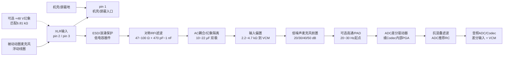

# 动圈麦克风输入电路设计

> 适用对象：被动动圈麦克风、XLR平衡输入、单路音频ADC/Codec。  
> 本页给出可落地的初版方案，最终阻值、增益和保护器件必须按目标麦克风、Codec数据手册和法规等级复核。  
> 关联词典：06_术语与公式/10-音频与电声术语 · 06_术语与公式/20-模拟电路与电源术语 · 06_术语与公式/60-公式总索引

## 1. 先确定接口性质

### 1.1 动圈麦不是驻极体麦

被动动圈麦克风的线圈由声压驱动产生电压，通常不需要偏置电压，也不需要麦克风模块上的2 V～5 V供电。它的输出阻抗常见约150 Ω～600 Ω，具体以型号数据手册为准；频率响应和灵敏度由振膜、线圈、磁路和声学结构决定。

不要把以下三类输入混为一类：

| 类型 | 是否需要偏置/幻象 | 常见接口 | 设计重点 |
|---|---|---|---|
| 被动动圈 | 通常不需要 | XLR平衡、TRS | 低噪声话放、增益、输入保护 |
| 电容麦/有源麦 | 需要供电 | XLR幻象、专用接口 | 48 V幻象、限流、退耦、启动噪声 |
| 驻极体麦头/模拟MEMS | 需要偏置 | 2线/3线模块 | 偏置电阻、AC耦合、低电平噪声 |

被动动圈麦通过XLR pin 2/pin 3连接浮动线圈时，麦克风端已经提供差分电压；不要在PCB上先把它强行变成单端再重新“伪造平衡”，这会损失共模抑制和抗干扰能力。

### 1.2 设计输入假设

本方案先按以下条件计算：

- 输入：XLR pin 2/3，浮动平衡动圈麦。
- 麦克风源阻抗：设计范围150 Ω～600 Ω，算例取200 Ω。
- 灵敏度：设计范围`-60 dBV/Pa`～`-50 dBV/Pa`，算例取`-55 dBV/Pa`。
- 声压范围：普通语音/演唱约80 dB SPL～120 dB SPL，具体上限以麦克风AOP和机械结构为准。
- 采样：48 kHz或96 kHz音频ADC/Codec，差分输入，共模电压和满量程以数据手册为准。
- 默认关闭幻象供电；若产品必须支持幻象，在输入端增加独立、可控、可放电的48 V路径。

## 2. 推荐系统框图

```text
XLR pin 2/3
  -> 机壳入口ESD/浪涌保护
  -> 对称RFI滤波与串联限流
  -> 幻象隔离/AC耦合（若支持幻象）
  -> 低噪声平衡麦克风前置放大器
  -> 可选高通、PAD、增益档位
  -> ADC驱动器/全差分放大器（若Codec没有合适PGA）
  -> 抗混叠滤波与ADC输入RC
  -> 音频Codec ADC
```

### 2.1 Mermaid框图



信号路径是`MIC -> XLR -> ESD/RFI -> AC耦合/VCM -> 话放 -> ADC驱动 -> ADC`；幻象供电是可关闭的辅助分支，不应成为动圈麦音频信号的直流工作点。

### 2.1 推荐拓扑优先级

| 方案 | 适用 | 建议 |
|---|---|---|
| Codec内置差分MIC PGA | 成本/面积敏感、Codec明确支持动态麦电平 | 优先按Codec参考设计，省掉重复转换级 |
| 专用低噪声麦克风前置 + 差分ADC | 专业音频、需要40～60 dB增益和高CMRR | 首选；增益和噪声容易单独验证 |
| 低噪声运放自建平衡前级 | 已有成熟模拟经验、需定制 | 必须对称布局、0.1%匹配电阻并实测CMRR |
| 变压器输入 | 地环路、隔离或特殊音色需求 | 作为产品选项；需检查低频饱和、漏磁、体积和成本 |

不要用“同相一级+反相两级串联”的方式生成差分信号：两路延迟、噪声和增益误差不一致。若ADC需要差分输出，应使用专用差分麦克风前置或FDA/对称差分结构。相关：[笔记/硬件/音频/非平衡转平衡]({{ '/notes/unbalanced-to-balanced/' | relative_url }})、[笔记/硬件/音频/串型差分放大]({{ '/notes/audio-differential-amplifier/' | relative_url }})。

## 3. XLR输入与保护

### 3.1 基础连接

```text
XLR pin 2 ---- 保护/串联R ---- AC耦合 ---- PREAMP IN+
XLR pin 3 ---- 保护/串联R ---- AC耦合 ---- PREAMP IN-
XLR pin 1 ---------------------- 机壳/屏蔽入口
```

- pin 2和pin 3必须保持完全对称：相同串联电阻、相同电容、相同走线长度和相同保护器件。
- XLR pin 1优先在连接器处直接接机壳/屏蔽参考，避免让ESD大电流穿过敏感音频地；具体接地策略还要结合产品结构、安规和EMC测试。
- 外部线缆入口的保护器件应靠近连接器，后级话放和ADC区域保持安静。

### 3.2 一个可打样的被动动圈输入参数

以下是初版值，不是通用标准：

| 位置 | 初值 | 设计意图 |
|---|---:|---|
| 每个信号脚串联电阻 | 47 Ω～100 Ω，0.1% | 限制ESD/射频脉冲，减小输入电容与源阻抗不连续 |
| pin 2-pin 3差模电容 | 470 pF～1 nF，C0G/NP0 | 抑制射频差模；先仿真再定值 |
| 每脚到机壳的共模电容 | 100 pF～470 pF，安全等级合适 | 把射频共模泄放到机壳，不能随意接模拟地 |
| AC耦合电容 | 10 µF～22 µF双极或薄膜，耐压≥63 V | 阻断幻象直流和输入偏置直流 |
| 每脚到VCM的偏置电阻 | 2.2 kΩ～4.7 kΩ，匹配 | 为单电源前置输入提供直流回路，并定义输入负载 |
| 前级输入钳位 | 低电容、低漏电，接规定模拟轨/VCM | 限制异常瞬态；不能让钳位噪声进入音频带 |

输入RFI差模极点粗估：若两脚串联电阻各100 Ω，pin 2-pin 3电容取1 nF，则差模等效约为

$$
f_{RFI}\approx\frac{1}{2\pi(200\ \Omega)(1\ nF)}\approx796\ kHz
$$

该极点远高于20 kHz音频带，但实际还要把保护器件、连接器和前置输入电容纳入仿真。

### 3.3 幻象供电分支

被动动圈麦本身通常不需要幻象，但若产品兼容电容麦，建议将幻象放在XLR连接器侧并由硬件开关控制：

```text
+48 V -> 保护/限流 -> 6.81 kΩ匹配电阻 -> XLR pin 2
                         6.81 kΩ匹配电阻 -> XLR pin 3
```

- 两个6.81 kΩ电阻必须匹配，避免把48 V共模变成差模直流。
- AC耦合电容必须按幻象最大电压、容差、漏电和插拔瞬态选型。
- 幻象开关要有软启动、关断放电和Pop/Click验证。
- 被动动圈在正确平衡接线下通常可承受幻象共模，但不应给非平衡接法、带中点接地的麦克风或被动铝带麦盲目加48 V；产品应默认关闭并提供保护。
- 幻象电源噪声要单独滤波，不要直接从数字升压模块送到XLR。

## 4. 增益预算：先算输入，再选话放

### 4.1 麦克风输出电压

若灵敏度以`dBV/Pa`给出，声压为$L_p$：

$$
V_{mic,RMS}=10^{S_{dBV/Pa}/20}\times10^{(L_p-94)/20}\quad V_{RMS}
$$

因为94 dB SPL约等于1 Pa。

以`-55 dBV/Pa`为例：

| 声压 | 声压倍数 | 麦克风输出 |
|---:|---:|---:|
| 80 dB SPL | 0.20 Pa | 0.356 mVrms |
| 94 dB SPL | 1 Pa | 1.778 mVrms |
| 120 dB SPL | 20 Pa | 35.6 mVrms |

### 4.2 前级增益

设Codec差分满量程定义为$V_{FS,diff}$，为防止峰值和公差削波，目标最大工作电平取$V_{target}=0.5V_{FS,diff}$：

$$
G_{max}=\frac{V_{target}}{V_{mic,max}}
$$

若$V_{FS,diff}=1.0\ Vrms$、麦克风在120 dB SPL输出35.6 mVrms：

$$
G_{max}=\frac{0.5}{0.0356}=14.0\ V/V=22.9\ dB
$$

若麦克风灵敏度为`-60 dBV/Pa`，120 dB SPL只有20 mVrms，则$G_{max}=25V/V=28.0dB$。

因此建议将模拟增益做成`20/30/40/50 dB`档，或用低噪声PGA连续/分档调节；最大声压时使用低增益，远讲/安静环境才切高增益。不要固定60 dB后再依赖数字衰减解决削波，前级已经削波的信号无法在数字域恢复。

### 4.3 输入阻抗

动圈麦源阻抗常在几百欧数量级。输入阻抗通常取源阻抗的5～10倍以上作为起点，例如200 Ω源可用2.2 kΩ～10 kΩ差分输入，但最终要结合麦克风频响、噪声和话放电流噪声验证。输入阻抗越高不一定越好：偏置电阻热噪声、射频敏感度、漏电和抗干扰会变差。

## 5. 噪声预算

### 5.1 输入等效噪声模型

以源阻抗$R_s$、话放电压噪声密度$e_n$、电流噪声密度$i_n$和带宽$B$估算：

$$
V_{n,in}\approx\sqrt{\left(e_n^2+i_n^2R_s^2+4kTR_s+\sum e_{R}^2\right)B+\left(\frac{V_{n,ADC}}{G}\right)^2}
$$

选择话放时不要只看$e_n$：低阻动圈麦还要看$i_n$、输入电阻噪声、1/f噪声、共模抑制和最大输出摆幅。

### 5.2 200 Ω算例

在300 K、20 Hz～20 kHz、$R_s=200 Ω$下，源电阻热噪声密度约：

$$
e_{R_s}=\sqrt{4kTR_s}\approx1.82\ nV/\sqrt{Hz}
$$

若话放$e_n=1.0 nV/\sqrt{Hz}$、$i_n=2 pA/\sqrt{Hz}$，则白噪声密度粗估约2.1 nV/√Hz，带内约0.30 µVrms。对应`-55 dBV/Pa`麦克风的等效声压约18 dB SPL；实际还应加输入电阻、1/f、ADC、供电和环境噪声裕量。

相关公式：06_术语与公式/60-公式总索引、06_术语与公式/10-音频与电声术语。

## 6. 前置放大器实现

### 6.1 专用麦克风前置

优先使用专用低噪声麦克风前置/仪表放大器，按其数据手册设置增益电阻、参考端和输入保护。增益公式不要从其他型号照搬；不同器件的增益常数、输入共模范围、输出摆幅和电源要求不同。

选择指标建议：

- 输入电压噪声：按150 Ω～600 Ω源阻抗噪声匹配，不只看1 kHz典型值。
- 输入电流噪声：低阻源下通常影响较小，但要与输入阻抗和保护电阻一起计算。
- CMRR：规定在20 Hz～20 kHz的最小值，而不是只看DC典型值。
- 增益范围：至少覆盖20～50 dB，切换时无明显Pop/Click。
- THD+N：目标带宽、负载和输出电平下满足产品指标。
- 输出共模：单电源时能稳定落在Codec要求的VCM；双电源时仍要确认后级ADC输入范围。

### 6.2 低噪声运放分立方案

如果用双运放或仪表放大器结构，正负输入路径必须做到：相同器件、相同电阻网络、0.1%或更高匹配、相同RC、对称布线和相同负载。不要用“同相一级+反相两级”产生差分输出。对于ADC差分驱动，优先使用专用FDA，设置VOCM为Codec推荐共模电压。

### 6.3 单电源与双电源

| 供电 | 优点 | 关键问题 |
|---|---|---|
| ±12 V/±15 V | 输入输出围绕0 V，模拟余量大，话放设计直观 | 电源成本、绝缘、静态功耗和Codec接口电平 |
| 5 V/3.3 V单电源 | 易与Codec/数字系统集成 | 输入AC耦合、VCM缓冲、输出摆幅、Pop和电源噪声 |

单电源方案中，VCM必须由低噪声、低阻抗缓冲器提供，不能直接用高阻分压点；VCM噪声会以共模/差模方式进入ADC。

## 7. ADC接口与抗混叠

### 7.1 Codec已有差分MIC PGA时

如果Codec数据手册明确支持麦克风差分输入和内部PGA：

1. 直接按其输入偏置、满量程、共模、输入电容和推荐RC连接。
2. 不要在Codec前再加一个无必要的FDA，避免噪声和失真累积。
3. 用外部低噪声话放提供主要模拟增益，Codec PGA只做小范围校准。
4. 逐节点测量`XLR -> 话放输出 -> ADC引脚`的RMS、Peak、DC和频响。

### 7.2 Codec需要外部差分驱动时

使用FDA或器件推荐的差分驱动器：

- 设置输出共模为$V_{OCM}$，确认ADC输入范围。
- 反馈电阻和输入电阻用匹配网络，差模增益按$A_v=R_f/R_g$核算。
- 反馈电容用于稳定和抗射频，不要未经仿真把大电容直接挂在输出。
- ADC脚前的串联电阻与采样电容必须按Codec推荐值；ADC采样瞬态可能让驱动器振铃。
- 抗混叠滤波器截止频率不等于“随便放在采样率一半”。48 kHz系统通常以20～22 kHz为设计起点，并根据24 kHz处所需衰减、群延迟和THD选择阶数。

## 8. 电源、地和PCB布局

```text
XLR/机壳入口 -> ESD泄放 -> 话放输入
                         |
                      安静模拟地/VCM
数字DC-DC/时钟/Class-D -> 远离输入、单独回流
```

- 话放输入差分对在连续参考平面上走线，不跨地缝和高di/dt电源回路。
- XLR pin1、屏蔽和ESD电流优先走机壳路径；不要让ESD电流经过话放地。
- 话放、VCM缓冲和ADC驱动各自就近退耦；模拟LDO和数字电源分区，但不要把地平面切成导致回流绕路的孤岛。
- 幻象48 V、升压电源、USB、I2S时钟和Class-D输出远离XLR输入；必要时用屏蔽、磁珠/共模滤波和分区验证。
- 差分对正负两路的串阻、电容、钳位、过孔数和走线长度保持一致。

## 9. 推荐初版BOM方向

| 模块 | 初版建议 | 选择理由 |
|---|---|---|
| 话放 | 专用低噪声MIC preamp或低噪声仪表放大器 | 低EIN、增益可控、CMRR可验证 |
| ADC驱动 | Codec内置PGA；否则FDA | 减少不必要的单端/差分转换级 |
| 输入串阻 | 47 Ω～100 Ω成对 | ESD/RFI与音频噪声折中 |
| 差模RFI电容 | 470 pF～1 nF C0G | 由实际射频抗扰度调试 |
| AC耦合 | 10 µF～22 µF双极、≥63 V（兼容幻象时） | 低频极点和幻象耐压 |
| 输入偏置 | 2.2 kΩ～4.7 kΩ成对 | 直流回路、输入阻抗和噪声折中 |
| 增益档位 | 20/30/40/50 dB起步 | 覆盖动圈麦灵敏度和近讲/远讲 |
| 电源 | 低噪声模拟LDO，VCM单独缓冲 | 降低话放和ADC参考污染 |

具体型号可从已有器件库中筛选，但必须按`EIN、CMRR、最大输入、增益公式、供电和输出摆幅`重新核对，不能只因“音频专用”就直接使用。

## 10. 测试与验收SOP

### 10.1 上电和安全

1. 不接麦克风，检查XLR pin 2/3对机壳、对模拟地和相互之间的DC电压。
2. 幻象关闭时，pin 2/3差分DC应接近0；记录实际值和关断放电时间。
3. 幻象开启时，验证pin 2/3的共模电压、两路匹配、限流和过流保护。
4. 插拔模拟麦、长线和不平衡转接头，检查Pop/Click和异常电流。

### 10.2 电性能

| 项目 | 方法 | 必须记录 |
|---|---|---|
| 输入阻抗 | 阻抗分析仪或已知源电阻法 | 频率、负载、幻象状态 |
| 增益 | 200 Ω平衡源，1 kHz正弦 | 增益档、输入/输出RMS、DC、VCM |
| 频响 | 20 Hz～20 kHz扫频 | 滤波、负载、增益、采样率 |
| EIN/噪声 | 200 Ω平衡端接，输入静音 | 20 Hz～20 kHz、A/Z计权、带宽、VCM |
| CMRR | pin2/pin3施加等幅同相信号 | 频率、共模电平、残余差模输出 |
| THD+N | 1 kHz逐级增大输入 | 带宽、滤波、增益、ADC满量程 |
| 最大输入 | 模拟源等效麦克风输出扫级 | 削波点、1%/10% THD+N、保护状态 |
| RFI/ESD | 外接长线、射频注入、ESD | 音频爆音、复位、误触发、永久损伤 |

CMRR可按同一增益下的共模输入与残余差模输出计算：

$$
CMRR=20\log_{10}\left(\frac{V_{CM,in}}{V_{DM,out}/G_{DM}}\right)
$$

不能把“没有听到噪声”当作CMRR合格；必须保留原始波形、频谱、测试条件和版本。

### 10.3 声学验证

- 使用校准声源或标准扬声器，在94 dB SPL、1 kHz校准灵敏度链路。
- 测80/94/110/120 dB SPL等效输入，检查话放增益、ADC余量、THD和限幅。
- 用真实动圈麦测语音、近讲效应、喷麦、手持噪声和电磁环境。
- 做不同麦克风批次、线缆长度、接口转接和幻象开关状态的回归。

相关：05_测试SOP/10-音频电性能测试SOP、05_测试SOP/20-电声测试SOP、01_理论补充/电声学测试与算法基础。

## 11. 最容易犯的错误

- 把动圈麦当驻极体麦，给线圈串偏置电阻或直接加低压供电。
- 直接把XLR pin 3接地，破坏平衡和共模抑制。
- 48 V幻象不匹配、无放电、无插拔Pop测试。
- 先用60 dB高增益，再靠数字音量解决模拟削波。
- 只看话放电压噪声，不看源阻抗、电流噪声和输入电阻噪声。
- 让ADC的差分输入一侧直接接地，忽略Codec要求的VCM。
- 用双运放两级串联生成正负信号，造成路径延迟和噪声不对称。
- 只测1 kHz和短线，不测CMRR、RFI、ESD、长线、Pop/Click和热漂移。

## 12. 交付前检查清单

- [ ] 已取得目标动圈麦的灵敏度、源阻抗、频响、最大SPL和接线图。
- [ ] 已取得Codec ADC满量程、共模、输入阻抗、采样电容和推荐RC。
- [ ] 增益预算覆盖最小灵敏度、最大声压、峰值因数和6 dB左右模拟余量。
- [ ] EIN、THD+N、CMRR、频响和最大输入均有目标值和测试条件。
- [ ] XLR、幻象、ESD、机壳地、模拟地和VCM的路径已在原理图/PCB标出。
- [ ] 输入保护器件不会在20 Hz～20 kHz引入明显失真、漏电或不平衡。
- [ ] 48 V幻象可关闭、限流、放电，并通过插拔和误接测试。
- [ ] 已完成LTspice/Spice小信号、噪声、AC和ADC负载仿真。
- [ ] 已完成样机电性能和声学测试，并保存原始数据与版本。
