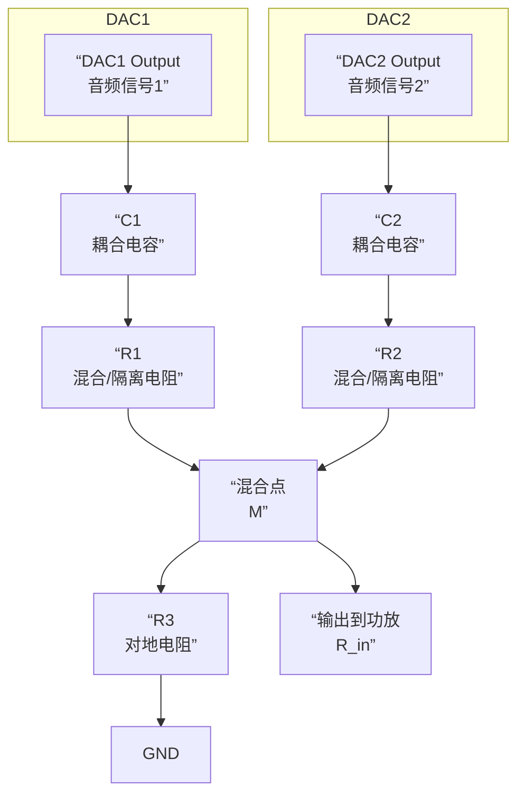

# 音频混合

将两段DAC音频信号通过电容耦合后混合，再输入到功放，这是一个典型的**音频混合电路**。要实现这个功能并保证音质，有几个关键点需要特别注意。

### 核心问题与注意事项

您设计的核心是一个 **“电容耦合 + 电阻混合”** 网络。其结构和工作原理如下图所示，它主要需要解决**阻抗匹配、信号隔离和混合比例**三个问题：

下面我们结合图示，详细分析需要注意的方面：

#### 1. 阻抗匹配与信号衰减（最关键！）

这是最可能出问题的地方。如图所示，电路中有三个关键的电阻：

*   **R1, R2（混合/隔离电阻）**：
    *   **作用**：防止两个DAC输出相互“看到”对方，避免信号串扰和负载效应。没有它们，一个DAC的输出会直接短路到另一个DAC的输出。
    *   **取值**：通常与功放输入阻抗 `R_in` 在同一数量级或略小。常用值在1kΩ到100kΩ之间。

*   **R3（对地电阻/终端电阻）**：
    *   **作用**：为混合后的信号提供一个到地的电流路径，并**与 R1、R2 以及功放输入阻抗 `R_in` 共同决定混合点的总阻抗和信号电压**。
    *   **计算**：混合点的总负载 `R_total` 是 `R3` 和功放输入电阻 `R_in` 的并联值。每个输入信号在混合点的电压是其开路电压乘以 `R_total / (R_src + R_total)`，其中 `R_src` 是 `R1` 或 `R2`。

*   **带来的影响**：
    *   **信号衰减**：由于电阻分压，**混合后的信号幅度会小于单个DAC的输出信号**。您必须预见到这种衰减，并确保最终送到功放的信号电平足够大，否则音量会很小。
    *   **计算示例**：如果DAC输出峰值2V，`R1 = R2 = 10kΩ`, `R3 = 10kΩ`, 功放 `R_in = 20kΩ`。则 `R_total = (10kΩ // 20kΩ) ≈ 6.67kΩ`。每个信号在混合点的电压约为 `2V * (6.67kΩ / (10kΩ + 6.67kΩ)) ≈ 0.8V`。两个0.8V信号混合，总电压可能达到1.6V，但这只是理想情况，实际需具体计算。

#### 2. 电容耦合的值选择

*   **电容 C1, C2**：
    *   **作用**：阻隔DAC输出可能存在的直流偏置电压，防止其影响其他DAC或功放。
    *   **取值**：与 `R1`、`R2` 和 `R_total` 构成**高通滤波器**。其截止频率 `f_c = 1 / (2 * π * R * C)`。
    *   **计算**：`R` 是电容后面的总电阻，对于C1来说是 `(R1 + R_total)`。为了确保低频响应，截止频率应远低于20Hz。例如，如果 `R ≈ 20kΩ`，想得到 `f_c ≈ 1Hz`，则 `C ≥ 1 / (2 * π * 20kΩ * 1Hz) ≈ 8μF`。通常选择 **4.7μF ~ 22μF** 的电解电容或钽电容，**注意极性！**

#### 3. 电平控制与混合比例

*   **独立控制**：如果您希望独立调节两个声源的音量，可以将 `R1` 和 `R2` 换成**电位器**。
*   **混合比例**：如果 `R1 = R2`，两个信号以相同权重混合。如果 `R1 > R2`，那么来自DAC1的信号衰减更大，在混合信号中DAC2的比重会更高。

#### 4. 噪声与稳定性

*   **电阻热噪声**：使用金属膜电阻以获得更低的噪声。
*   **寄生振荡**：线路较长时，可能在射频段产生振荡。可以在混合点与地之间接一个**小电容（如100pF）** 来抑制高频噪声，但这也会轻微影响音频高频。

### 总结与操作清单

1.  **确定参数**：查找您的DAC输出电平、输出阻抗和功放输入阻抗、输入灵敏度。
2.  **选择电阻**：
    *   `R1`, `R2` 建议从 **10kΩ** 开始尝试。它们是音量/混合比调节的关键。
    *   `R3` 建议从 **10kΩ** 开始尝试。它是决定总阻抗和衰减程度的关键。
3.  **选择电容**：根据公式计算，确保低频响应。**推荐使用 10μF 的无极性电容或注意极性的电解电容**。
4.  **预期衰减**：理解信号在经过电阻网络后会有衰减，如果最终音量不足，可以考虑：
    *   减小 `R1`, `R2` 的阻值（但会增加DAC负载）。
    *   增大 `R3` 的阻值（但会提高输出阻抗）。
    *   增加一个基于运放的混合电路，提供缓冲和增益。
5.  **搭建与测试**：
    *   先用示波器观察混合点的信号，确保波形正常，没有失真。
    *   再连接功放，慢慢调大音量试听。

**进阶方案**：
如果对音质和灵活性要求很高，最好的方法是使用**运放加法器电路**。每个DAC信号通过一个电阻输入到运放的反相输入端，通过选择反馈电阻，可以精确控制增益和混合比例，同时实现高输入阻抗和低输出阻抗，完美地驱动后级功放。
