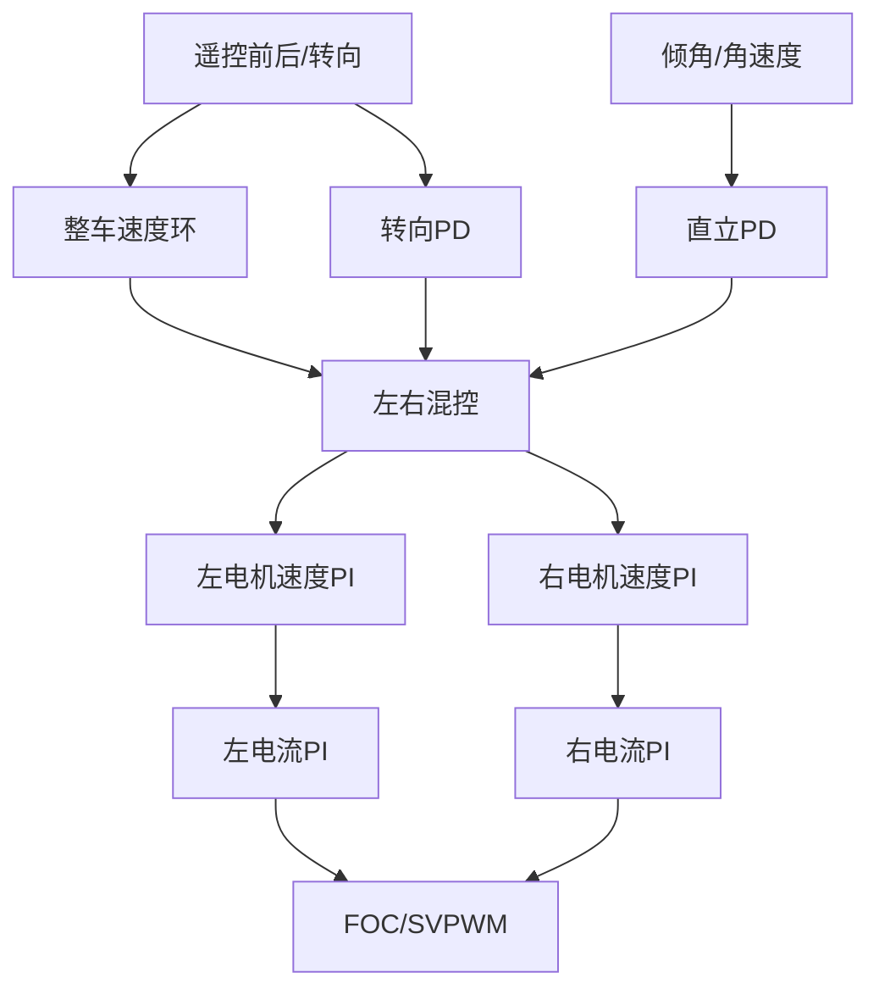
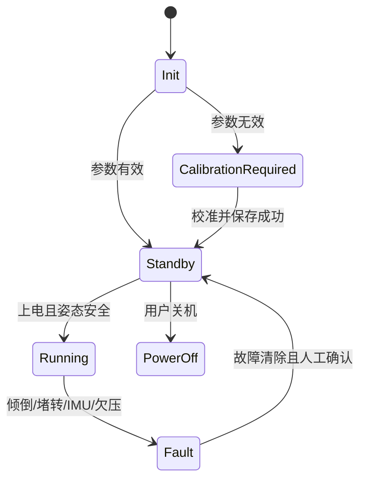

# 平衡车姿态与串级控制

## 1. 倒立摆直觉

普通摆的重心在支点下方，偏离后会自然回到底部。平衡车重心在轮轴上方，偏离后重力矩会让倾角继续增大，因此系统天然不稳定。

```text
车体向前倾
→ 重心落点在轮轴前方
→ 控制器让车轮向前运动
→ 轮轴追到重心下方
→ 倾角恢复
```

控制方向错误时，车轮会向后运动，重心离支撑点更远，系统会瞬间发散。

## 2. 坐标和符号约定

调试前必须写清：

- 车体前倾是正角还是负角。
- 陀螺Y轴向哪个方向为正。
- 左右编码器正方向。
- 正电流Iq产生哪个方向转矩。
- 遥控前推产生正还是负目标。

推荐建立单独表格：

| 物理动作 | 变量期望符号 |
|---|---|
| 车体向前倾 | `gyroAngle.y > 0`或明确相反 |
| 左轮向前转 | `M1_Encoder.Speed > 0` |
| 右轮向前转 | 可能因镜像安装而原始值小于0 |
| 遥控向前 | `Rc.x > 0` |

项目中右轮命令使用负号：

```c
M2SpeedControl(-ControlOut_R);
```

这通常用于补偿左右电机镜像安装方向。

## 3. IMU单位换算

MPU6500配置为：

- 陀螺量程约±2000 °/s，对应灵敏度16.4 LSB/(°/s)。
- 加速度量程约±8 g，对应灵敏度4096 LSB/g。

```c
gyro_dps = raw_gyro / 16.4f;
acc_g = raw_acc / 4096.0f;
```

零偏校准后：

```c
gyro_dps = raw_gyro / 16.4f - gyro_offset;
```

零偏单位必须与换算后的角速度单位一致。

## 4. 加速度倾角

当主要受重力作用时，可由重力在轴上的投影计算倾角：

```c
angle_y = -atan2f(acc_x, acc_z) * 57.2957795f;
```

`57.2957795 = 180/π`，用于弧度转角度。

局限：

- 车辆加减速时，水平加速度会被误认为重力分量。
- 电机振动会让角度噪声增大。
- 接近特殊姿态时要确认轴定义和 `atan2` 参数顺序。

## 5. 陀螺积分

```text
angle[k] = angle[k-1] + gyro_rate[k] × Ts
```

本项目1 ms更新：

```c
mpu6500.gyroAngle.y += mpu6500.gyro.Primitive.y * 0.001f;
```

陀螺短期响应快，但即使只有 `0.1 °/s` 零偏，10秒后也会漂移1°。

## 6. 互补滤波

```text
angle = alpha × (previous_angle + gyro × Ts)
      + (1-alpha) × acc_angle
```

项目使用：

```c
angle = angle * 0.999f + acc_angle * 0.001f;
```

参数解释：

| 参数 | 效果 |
|---|---|
| `alpha`接近1 | 更相信陀螺，动态快，但漂移修正慢 |
| `alpha`较小 | 更相信加速度，长期稳定，但受运动加速度影响大 |

一阶互补滤波近似关系：

```text
alpha = tau / (tau + Ts)
tau = alpha × Ts / (1-alpha)
fc = 1 / (2πtau)
```

`alpha=0.999, Ts=0.001 s`：

```text
tau ≈ 0.999 s
fc ≈ 0.159 Hz
```

意味着加速度主要负责非常低频的漂移修正。

## 7. 控制层次



## 8. 直立环

```c
PID_Adjust_T(&UprightPID,
             0.0f,
             -mpu6500.gyroAngle.y,
             mpu6500.gyro.Primitive.y);
```

参数含义：

| 参数 | 含义 |
|---|---|
| `0.0f` | 目标倾角，当前希望直立 |
| `-gyroAngle.y` | 实际倾角，负号来自坐标定义 |
| `gyro.Primitive.y` | 角速度，作为D项阻尼 |

直立环每1 ms运行一次。输出不是直接PWM，而是左右电机的基础速度目标。

## 9. 整车速度环

```c
Car.Speed = M1_Encoder.Speed_filterA - M2_Encoder.Speed_filterA;
PID_Adjust_S(&SpeedPID, 0.0f, -Car.Speed, Car.ControlY);
```

左右轮原始方向相反，因此采用减法得到车体同向速度。`PID_Adjust_S` 位于闭源库，第三个参数 `Car.ControlY` 用于加入遥控速度命令。

速度环每2 ms更新，输出用于消除车辆长期漂移以及响应遥控前后命令。

## 10. 转向环

```c
PID_Adjust_T(&TurnPID,
             Car.ControlZ,
             0.0f,
             mpu6500.gyro.Primitive.z);
```

转向目标来自遥控，陀螺Z轴角速度提供阻尼。转向环输出以相反符号加入左右轮。

## 11. 左右轮混控

```c
ControlOut_L = UprightPID.PID_Out
             + SpeedPID.PID_Out
             + TurnPID.PID_Out;

ControlOut_R = UprightPID.PID_Out
             + SpeedPID.PID_Out
             - TurnPID.PID_Out;
```

物理效果：

| 分量 | 左轮 | 右轮 | 结果 |
|---|---:|---:|---|
| Upright | 同号 | 同号 | 前后追赶重心 |
| Speed | 同号 | 同号 | 整车前后运动 |
| Turn | 正 | 负 | 左右差速旋转 |

## 12. 多速率控制

当前设计大致是：

| 控制环 | 调用位置 | 目标周期 |
|---|---|---|
| FOC/电流环 | ADC硬件中断 | 最高频 |
| 单电机速度环 | FOC回调每2次更新 | 约200 us注释值 |
| 直立环 | `App_1ms` | 1 ms |
| 整车速度/转向环 | 每2次 `MotorControl` | 2 ms |
| 电池、按键、灯光 | `App_1ms` | 1 ms基础节拍 |

越靠内层越快。改变任何周期都需要重新审视滤波和PID离散参数。

## 13. 保护状态

运行条件包括：

```text
校准数据有效
AND 用户已上电使能
AND 保护标志已解除
AND 倾角小于70°
AND IMU无故障
```

项目保护逻辑包含：

- 静止一定时间后解除保护。
- 倾角超过70/75°停止输出。
- Iq接近限制并持续1秒时判定堵转。
- 高速和异常加速度条件触发保护。
- 电池低于7 V时灯光提示。
> **注意：> README明确说明传感器和电机保护仍不完整。保护逻辑需要独立于正常控制进行故障注入测试。**
## 14. 状态机建议



每个状态应明确：PWM是否允许、驱动使能是否允许、哪些命令有效、如何退出该状态。

## 15. 调参和上板顺序

1. 不装车轮负载，确认编码器方向和电角度校准。
2. 验证电流环，不启用平衡控制。
3. 验证单电机速度环与左右方向。
4. 架空整车，用手小角度倾斜，确认车轮追赶方向。
5. 限制最大输出，扶持车辆调直立PD。
6. 直立稳定后再开整车速度环。
7. 最后加入转向和遥控灵敏度。

## 本章练习

1. 计算 `alpha=0.995, Ts=1 ms` 的时间常数和截止频率。
2. 画出车体前倾时倾角、角速度、直立输出和轮速的期望符号。
3. 暂时关闭速度环，观察纯直立环的漂移行为。
4. 给保护逻辑整理成显式枚举状态机。
5. 记录倾角阶跃扰动后的最大角度、恢复时间和电流峰值。

## 掌握检查

- [ ] 能解释倒立摆为什么天然不稳定。
- [ ] 能完成IMU原始值和角度单位换算。
- [ ] 能解释互补滤波系数与采样周期的关系。
- [ ] 能说明直立、速度、转向和电机内环的层次。
- [ ] 能根据物理动作验证整个控制符号链。

上一章：[07-FOC无刷电机控制]({{ '/notes/foc-motor-control/' | relative_url }})  下一章：[09-传感器与数字滤波]({{ '/notes/sensors-digital-filtering/' | relative_url }})
