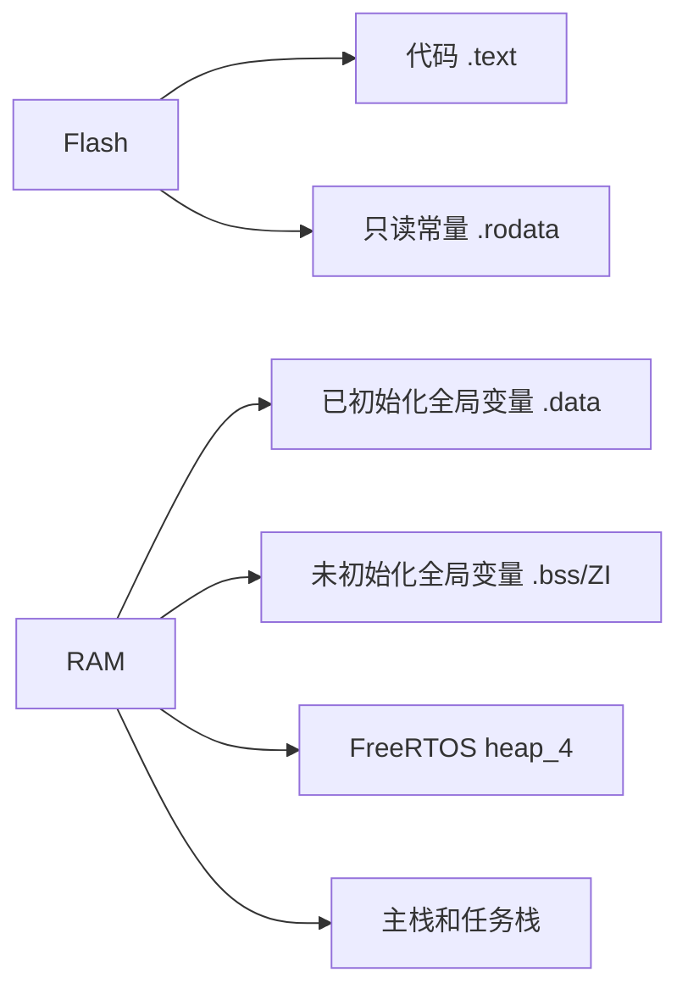

# C语言与嵌入式内存

## 1. 固定宽度整数

嵌入式程序应优先使用 `<stdint.h>` 中的固定宽度类型。

| 类型 | 位宽 | 常见用途 |
|---|---:|---|
| `uint8_t` | 8 | 字节、串口数据、状态标志 |
| `int8_t` | 8 | 摇杆偏移、较小有符号量 |
| `uint16_t` | 16 | ADC值、编码器值、计数器 |
| `int16_t` | 16 | IMU原始数据、差值 |
| `uint32_t` | 32 | 地址、时间计数、DWT周期 |
| `float` | 32 | 角度、速度、电流、PID参数 |

### 参数范围例程

```c
#include <stdint.h>

uint16_t encoder = 32760U;
int16_t error = -120;
float current_a = 0.75f;
```
> **注意：> `uint16_t value = -1;` 的结果不是 `-1`，而是 `65535`。混合有符号和无符号运算时必须先确认整数提升规则。**
### 溢出例程

```c
uint16_t count = 65535U;
count++;
/* count变成0，这是无符号整数定义良好的回绕。 */
```

编码器回绕计算正是利用“差值”和边界判断处理这一问题，参考 Control.c 中的 `SpeedCompute()`。

## 2. 指针与内存映射寄存器

外设寄存器本质是固定地址上的内存。

```c
#define REG32(address) (*(volatile uint32_t *)(address))

REG32(0x40000000UL) = 0x01UL;
```

参数含义：

| 部分 | 含义 |
|---|---|
| `uint32_t *` | 指向32位数据的指针 |
| `(address)` | 把整数地址转换为指针 |
| `*` | 访问该地址中的数据 |
| `volatile` | 每次都真正访问硬件，禁止缓存寄存器值 |

实际工程使用厂商提供的结构体映射，例如：

```c
TMR4->c4dt = 0;
ADC2->pdt3_bit.pdt3;
GPIOB->scr = GPIO_PINS_2;
```

## 3. `volatile` 的正确理解

`volatile`解决的是“编译器优化可见性”，不是线程安全。

```c
volatile uint8_t uart_rx_ready;

void USART1_IRQHandler(void)
{
    uart_rx_ready = 1U;
}

void Task(void)
{
    if(uart_rx_ready != 0U)
    {
        uart_rx_ready = 0U;
        ProcessData();
    }
}
```

它能保证任务重新读取 `uart_rx_ready`，但下面的复合操作仍然不是原子的：

```c
volatile uint32_t count;
count++;  /* 读取、加一、写回，共多个步骤。 */
```

如果任务和中断都执行 `count++`，可能丢失更新。解决方案见 [05-实时并发与数据安全]({{ '/notes/realtime-concurrency/' | relative_url }})。

## 4. `static`、`extern` 与链接

### 文件内私有变量

```c
static uint16_t sample_count;
```

文件作用域的 `static` 表示该符号只在当前 `.c` 文件可见。

### 跨文件共享变量

```c
/* control.c：只定义一次 */
Car_t Car;

/* control.h：其他文件看到的是声明 */
extern Car_t Car;
```
> **安全警告：> 不要在头文件直接写 `Car_t Car;`。多个 `.c` 包含该头文件会产生重复定义，或者依赖编译器的非标准合并行为。**
### 函数内部静态变量

```c
void KeyScan(void)
{
    static uint16_t debounce_count;
    debounce_count++;
}
```

函数退出后该变量仍保留值，因此函数可能不可重入。

## 5. 结构体、联合体和位域

结构体用于把同一对象的数据放在一起：

```c
typedef struct
{
    float kp;
    float ki;
    float integral;
    float out_min;
    float out_max;
} PI_Controller_t;
```

使用结构体指针可以让同一算法操作多个控制器：

```c
float PI_Update(PI_Controller_t *pi, float target, float feedback)
{
    float error = target - feedback;
    pi->integral += error * pi->ki;
    return error * pi->kp + pi->integral;
}
```

联合体让同一段内存拥有不同访问形式：

```c
typedef union
{
    uint16_t all;
    struct
    {
        uint16_t imu_fault : 1;
        uint16_t encoder_fault : 1;
        uint16_t reserved : 14;
    } bit;
} Fault_t;
```

位域适合状态表达，但位顺序和布局与编译器有关，不应直接作为跨平台通信协议格式。

## 6. 对齐与 `packed`

```c
typedef struct
{
    uint8_t command;
    uint32_t value;
} Normal_t;
```

由于32位对齐，`value`前面可能插入3字节填充，结构体大小可能是8字节。

```c
typedef struct
{
    uint8_t command;
    uint32_t value;
} __attribute__((packed)) Packed_t;
```

`packed`后大小可能是5字节，但未对齐的32位访问可能更慢，部分CPU甚至会产生异常。通信和Flash结构必须明确规定字节布局，不要依赖默认结构体布局。

## 7. 栈、堆、全局区和Flash



| 区域 | 示例 | 初始化方式 |
|---|---|---|
| `.text` | 函数机器码 | 存在Flash |
| `.rodata` | `const`查表 | 存在Flash |
| `.data` | `uint8_t mode = 1;` | 启动时从Flash复制到RAM |
| `.bss/ZI` | `uint8_t buffer[128];` | 启动时清零 |
| heap | `xTaskCreate()`分配 | 运行时分配 |
| stack | 局部变量、返回地址 | 函数调用或任务运行时使用 |

当前FreeRTOS配置使用12 KB堆，参考 FreeRTOSConfig.h。

## 8. 宏的常见问题

错误写法：

```c
#define LIMIT  1+2
float value = LIMIT * 3; /* 结果是7，不是9。 */
```

正确写法：

```c
#define LIMIT  (1 + 2)
#define CLAMP(x, low, high) (((x) < (low)) ? (low) : (((x) > (high)) ? (high) : (x)))
```

函数式宏可能多次计算参数：

```c
int i = 0;
int x = CLAMP(i++, 0, 10); /* i可能被计算多次，禁止这样使用。 */
```

## 9. 可重入性

不可重入函数示例：

```c
uint8_t shared_buffer[64];

void BuildPacket(const uint8_t *data)
{
    memcpy(shared_buffer, data, 64);
    Send(shared_buffer);
}
```

两个任务同时调用会互相覆盖。可选解决方法：调用者提供缓冲区、互斥量保护，或保证只有一个任务拥有该模块。

## 本章练习

1. 计算 `CaliData_t` 在packed和非packed情况下可能的大小。
2. 找出项目中由中断写、任务读的全局标志。
3. 解释 `M1_Foc.Vq = 0.0f` 是否是原子写，以及为何多个字段仍可能不一致。
4. 根据MAP文件找出FreeRTOS堆、主栈和任务代码的位置。

## 掌握检查

- [ ] 能解释声明和定义的区别。
- [ ] 能解释 `volatile` 能做什么、不能做什么。
- [ ] 能根据类型位宽判断溢出结果。
- [ ] 能解释结构体填充与packed风险。
- [ ] 能画出Flash、RAM、栈和堆的关系。

下一章：[02-Cortex-M4与中断系统]({{ '/notes/cortex-m4-interrupts/' | relative_url }})
