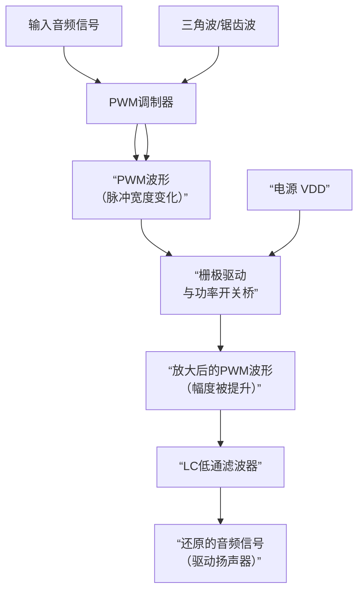

# 原理

好的，我们来彻底讲清楚D类功放的工作原理。它的设计非常巧妙，核心思想是 **“用开关（数字）的方式来实现模拟信号的放大”** ，从而获得极高的效率。

### 一个核心类比：用开关控制水龙头

想象一下，你想用一个只有“全开”和“全关”两种状态的开关阀门，来控制一个水车的平均转速。

1.  **慢速旋转**：你可以让阀门**开1秒，关9秒**。在这10秒内，水车只受到了1秒的强力冲击，平均转速很慢。
2.  **快速旋转**：你可以让阀门**开9秒，关1秒**。水车在10秒内受到了9秒的冲击，平均转速很快。
3.  **中速旋转**：**开5秒，关5秒**，平均转速适中。

你会发现，通过控制 **“开”和“关”的时间比例**，即使阀门只有两种极端状态，也能精确地控制水车的**平均受力**，从而实现无级调速。

**这就是D类功放最核心的思想——脉冲宽度调制（PWM）。**

---

### D类功放的工作步骤

D类功放的工作流程可以清晰地分为四个阶段，如下图所示：

#### 第1步：PWM调制（模拟信号 -> 数字脉冲）

*   **输入**：连续的模拟音频信号（一个平滑变化的波形）。
*   **载波**：一个频率非常高（通常为几百kHz）的三角波或锯齿波。
*   **过程**：将输入的音频信号与这个高频三角波同时送入一个**比较器**。
    *   当**音频信号的电压 > 三角波电压**时，比较器输出**高电平**。
    *   当**音频信号的电压 < 三角波电压**时，比较器输出**低电平**。
*   **输出**：得到一串脉冲宽度变化的方波，这就是**PWM波形**。
    *   **音频波形的幅度越高**，输出的脉冲就越宽。
    *   **音频波形的幅度越低**，输出的脉冲就越窄。
    *   此时，音频信息被编码到了脉冲的“宽度”中。

#### 第2步：功率开关放大（提升脉冲的功率）

*   **输入**：上一步产生的低功率PWM信号。
*   **过程**：这个PWM信号被送到一个由**功率MOSFET管**组成的全桥或半桥电路。这个电路相当于一个高速的电子开关。
    *   当PWM信号为高电平时，开关导通，将输出连接到电源正极（+VDD）。
    *   当PWM信号为低电平时，开关断开，将输出连接到电源地（GND）。
*   **输出**：得到一串**幅度被放大到电源电压水平**的PWM波形。脉冲的形状和宽度与之前完全一致，但“力量”变强了，足以驱动扬声器。这是主要的能量转换阶段。

#### 第3步：低通滤波（从脉冲中还原声音）

*   **输入**：高功率的PWM波形。
*   **过程**：这个方波包含了我们需要的**低频音频成分**和我们不需要的**高频开关成分**。一个由电感（L）和电容（C）组成的低通滤波器被用来滤除这些高频成分。
*   **工作原理**：电感的特性是“阻高频、通低频”，电容的特性是“通高频、阻低频”。将它们巧妙组合，就可以让低频的音频信号顺利通过，而将高频的PWM载波成分短路到地。
*   **输出**：经过滤波后，脉冲序列的**平均值**被提取出来，重新变回了**放大后的、平滑的模拟音频信号**。这个信号与输入信号形状一致，但幅度（电压和电流）大大增加。

#### 第4步：驱动扬声器

*   最终还原出的强大模拟音频信号推动扬声器的音圈振动，从而发出声音。

---

### 为什么D类功放效率如此之高？

这是D类功放最大的优势。

*   **传统功放（如A类、AB类）**：功率管工作在线性区，始终有电流通过。它就像一个可以部分开启的阀门，即使只需要很小的水流，也需要顶着巨大的水压去费力地“夹紧”阀门，这会产生大量的热量损耗（功率以热的形式消耗在晶体管上）。
*   **D类功放**：功率管只工作在两种极端状态：**完全导通**和**完全截止**。
    *   **完全导通**时，晶体管电阻极小，虽然电流很大，但管压降很小（V ≈ 0），所以发热功率 `P = V * I` 很小。
    *   **完全截止**时，没有电流通过（I = 0），所以发热功率 `P = V * I` 也为零。
    *   主要的损耗发生在 **“开”和“关”状态切换的瞬间**，因为这个过程不是瞬间完成的。但由于开关速度极快，这个切换时间非常短，所以平均下来损耗很小。

因此，D类功放的效率通常可以达到 **90%以上**，而AB类功放通常只有50%-70%。这意味着D类功放更省电、发热量小，可以使用更小的散热器甚至无需散热器。

### 总结

| 特性 | D类功放 | 传统模拟功放（如AB类） |
| :--- | :--- | :--- |
| **工作模式** | 开关模式（数字式） | 线性模式（模拟式） |
| **效率** | **高（>90%）** | 低（~60%） |
| **发热** | 小 | 大 |
| **体积/重量** | 小巧轻便（因散热器小） | 庞大笨重 |
| **音质** | 早期产品较差，现代高端产品音质极佳 | 理论上是纯粹的模拟放大，音质有“模拟味” |
| **适用场景** | 便携设备、汽车音响、有源音箱、家庭影院 | 高端Hi-Fi、对音质有极致要求的场合 |

简单来说，D类功放是一个 **“模拟 -> 数字（PWM） -> 模拟”** 的过程。它通过牺牲电路的复杂性（需要调制和滤波），换来了极高的效率，这完美契合了现代电子设备对节能、小型化的需求。
