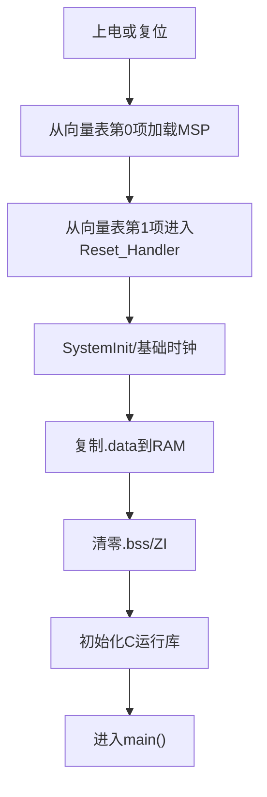
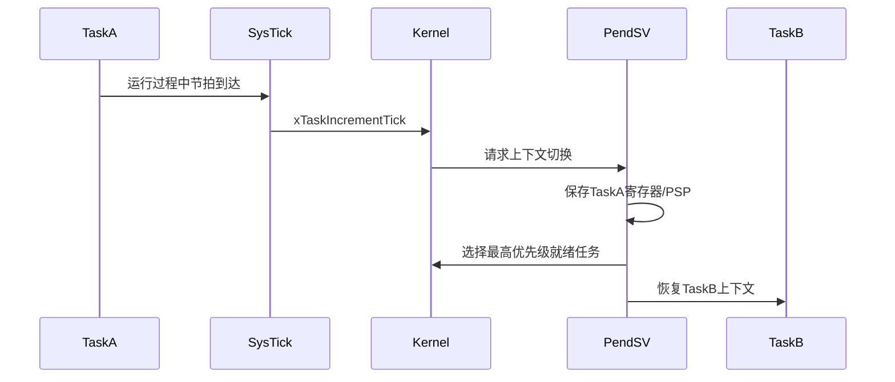

# Cortex-M4与中断系统

## 1. 从复位到 `main()`



向量表位于启动文件 startup_at32f413.s。每个表项保存一个异常或中断处理函数地址。

## 2. 关键核心寄存器

| 寄存器 | 含义 | 本项目用途 |
|---|---|---|
| MSP | 主栈指针 | 复位和中断默认使用 |
| PSP | 进程栈指针 | FreeRTOS任务使用各自PSP |
| CONTROL | 选择线程模式使用MSP或PSP | FreeRTOS启动首任务时设置 |
| xPSR | 条件标志、Thumb状态、异常号 | 异常自动压栈 |
| PRIMASK | 屏蔽除NMI/HardFault外所有可屏蔽中断 | 极短全局临界区 |
| BASEPRI | 屏蔽某个优先级及以下紧迫度的中断 | FreeRTOS临界区 |
| IPSR | 当前异常号，0表示线程模式 | 判断是否位于中断中 |

### 判断当前是否在中断中

```c
if(__get_IPSR() == 0U)
{
    /* 线程或任务上下文 */
}
else
{
    /* 异常或中断上下文 */
}
```

当前 delay.c 正是用它避免在中断中调用 `vTaskDelay()`。

## 3. 异常自动压栈

Cortex-M进入异常时，硬件自动保存：

```text
R0, R1, R2, R3, R12, LR, PC, xPSR
```

处理函数返回时硬件自动恢复。编译器还会根据函数使用情况保存R4到R11。使用FPU时，浮点寄存器可能通过惰性压栈保存。
> **说明：> 中断函数越复杂，压栈和执行时间越长。FOC中断中不应执行打印、Flash写入或阻塞等待。**
## 4. NVIC优先级

本芯片实现4个优先级位，因此有效抢占优先级为0到15。

| 数值 | 紧迫度 | 示例 |
|---:|---|---|
| 0 | 最高 | ADC/FOC中断 |
| 2 | 很高 | 原TMR5、部分DMA |
| 3 | 中高 | USART中断 |
| 5 | 较低 | 可调用FreeRTOS FromISR API的边界 |
| 15 | 最低 | SysTick/PendSV通常位于最低优先级 |

```c
nvic_priority_group_config(NVIC_PRIORITY_GROUP_4);
nvic_irq_enable(ADC1_2_IRQn, 0, 0);
```

参数解释：

| 参数 | 含义 |
|---|---|
| `ADC1_2_IRQn` | 中断号 |
| 第一个 `0` | 抢占优先级 |
| 第二个 `0` | 子优先级；Group 4下实际无子优先级位 |
> **安全警告：> “任务优先级5”和“NVIC优先级5”含义相反。FreeRTOS任务数字越大优先级越高；NVIC数字越小优先级越高。**
## 5. 中断嵌套示例

假设USART优先级为6，ADC优先级为0：

```text
USART中断执行
  ├─ ADC事件到来
  ├─ USART被暂停
  ├─ ADC中断完成FOC
  └─ 返回USART继续执行
```

如果ADC中断执行时间太长，低优先级中断和任务延迟会增加；如果低优先级中断太长，不会阻止ADC抢占，但会增加CPU总负载。

## 6. PRIMASK与BASEPRI

### 全局关中断

```c
uint32_t primask = __get_PRIMASK();
__disable_irq();

shared_left = new_left;
shared_right = new_right;

__set_PRIMASK(primask);
```

优点是能保护包括ADC在内的所有普通中断；缺点是直接增加FOC响应延迟，因此只能保护几个赋值指令。

### FreeRTOS临界区

```c
taskENTER_CRITICAL();
shared_value = value;
taskEXIT_CRITICAL();
```

FreeRTOS通过BASEPRI屏蔽允许调用系统API的中断，但优先级0的ADC仍能执行。因此它不能保护所有与ADC共享的数据。

## 7. SysTick、PendSV与SVC



| 异常 | FreeRTOS用途 |
|---|---|
| SVC | 启动第一个任务 |
| PendSV | 执行任务上下文切换 |
| SysTick | 产生系统节拍、更新延时和超时 |

当前工程通过 FreeRTOSConfig.h 将官方端口处理函数映射到启动文件需要的名称。

## 8. DWT周期计数器

DWT的 `CYCCNT` 每个CPU周期加一。200 MHz时：

```text
1 us = 200 cycles
10 us = 2000 cycles
1 ms = 200000 cycles
```

最小例程：

```c
void DWT_Init(void)
{
    CoreDebug->DEMCR |= CoreDebug_DEMCR_TRCENA_Msk;
    DWT->CYCCNT = 0U;
    DWT->CTRL |= DWT_CTRL_CYCCNTENA_Msk;
}

uint32_t start = DWT->CYCCNT;
RunFunction();
uint32_t elapsed = DWT->CYCCNT - start;
float time_us = elapsed / 200.0f;
```

无符号减法可以正确处理一次计数器回绕，但被测时间必须短于完整回绕周期。

## 9. HardFault基础定位

常见原因：

- 空指针或非法地址访问。
- 栈溢出破坏返回地址。
- 未对齐访问。
- 执行了无效函数地址。
- 中断向量错误或重复定义。
- FPU配置与编译选项不一致。

发生HardFault后应检查：PC、LR、xPSR、CFSR、HFSR、BFAR、MMFAR。详细流程见 [11-调试故障与上板流程]({{ '/notes/debug-and-hardware-bringup/' | relative_url }})。

## 本章练习

1. 解释ADC优先级0为什么能抢占USART优先级6。
2. 写一个DWT测量 `IMU_handle()` 执行时间的例程。
3. 说明为什么 `taskENTER_CRITICAL()` 不一定能阻止ADC中断访问共享变量。
4. 在MAP文件中确认SVC、PendSV、SysTick来自FreeRTOS `port.o`。

## 掌握检查

- [ ] 能画出复位到main的过程。
- [ ] 能解释MSP和PSP的区别。
- [ ] 能正确比较任务优先级和NVIC优先级。
- [ ] 能解释SysTick、PendSV和SVC各自职责。
- [ ] 能用DWT测量函数执行时间。

上一章：[01-C语言与嵌入式内存]({{ '/notes/c-language-memory/' | relative_url }})  下一章：[03-AT32外设驱动基础]({{ '/notes/at32-peripherals/' | relative_url }})
