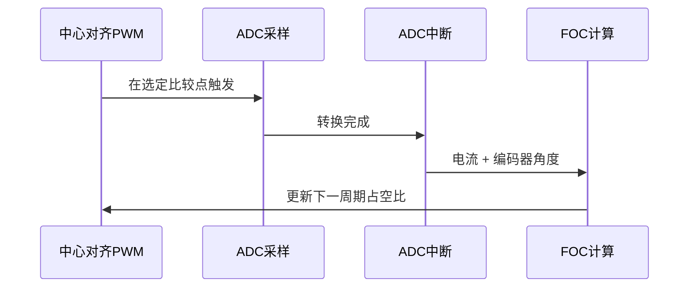

# FOC无刷电机控制

## 1. 电机对象

FOC通常控制永磁同步电机PMSM。很多小型无刷电机被称为BLDC，但只要能够获得转子角度并进行正弦电流控制，也可以使用FOC。

关键对象：

- 定子三相绕组A、B、C。
- 转子永磁体。
- 机械角度：转子实际转过的角度。
- 电角度：磁场在一个电周期中的角度。
- 极对数：转子有多少对N/S磁极。

## 2. 机械角与电角

```text
电角度 = 机械角度 × 极对数 + 电角度零偏
```

如果电机为4对极，机械旋转一圈时电角度旋转4圈。

```c
float electrical_angle = mechanical_angle * pole_pairs + offset;
```

角度必须归一化到一个周期，例如0到 `2π`：

```c
while(electrical_angle >= 2.0f * PI)
    electrical_angle -= 2.0f * PI;

while(electrical_angle < 0.0f)
    electrical_angle += 2.0f * PI;
```

> **安全警告**
> 极对数错误或零偏错误会让电压矢量与转子磁场错位，表现为电流很大、转矩很小、抖动或反转。

## 3. 为什么要坐标变换

三相电流是随电角度变化的正弦量，直接分别控制三个相电流较复杂。FOC通过坐标变换把它们转换到随转子一起旋转的坐标系，使稳态电流变成近似直流量。


## 4. 三相电流关系

理想三相星形系统满足：

```text
Ia + Ib + Ic = 0
```

因此知道两相电流可以计算第三相：

```text
Ic = -Ia - Ib
```

实际采样拓扑可能是：

- 三电阻采样：三相均测量，冗余但方便诊断。
- 双电阻采样：测两相，计算第三相。
- 单电阻母线采样：成本低，但采样重构复杂、受PWM矢量限制。

本工程README明确要求 `0.05 Ω` 采样电阻，因为闭源库中的电流换算与此硬件参数绑定。

## 5. Clarke变换

常见幅值不变形式之一：

```text
Ialpha = Ia
Ibeta  = (Ia + 2·Ib) / √3
```

不同库可能采用功率不变或幅值不变系数，因此公式前系数可能不同。只要正逆变换和控制参数保持一致即可。

```c
float i_alpha = ia;
float i_beta = (ia + 2.0f * ib) * 0.577350269f;
```

## 6. Park变换

Park变换把静止的αβ坐标旋转到转子dq坐标：

```text
Id =  Ialpha·cos(theta) + Ibeta·sin(theta)
Iq = -Ialpha·sin(theta) + Ibeta·cos(theta)
```

| 分量 | 物理意义 |
|---|---|
| Id | 与转子磁链方向一致，主要影响磁链 |
| Iq | 与转子磁链正交，主要产生转矩 |

表贴式PMSM常使用：

```text
Id_target = 0
Iq_target = 转矩/电流命令
```

弱磁高速运行时可能给负Id，但本平衡车低压低速应用通常不需要弱磁。

## 7. 电流环

```c
float id_error = id_target - id_feedback;
float iq_error = iq_target - iq_feedback;

vd = PI_Id(id_error);
vq = PI_Iq(iq_error);
```

项目中的用户侧实现：

```c
PID_Adjust(&M1CurrentIdPID, 0.0f, M1_Foc.Id);
M1_Foc.Vd = M1CurrentIdPID.PID_Out;

PID_Adjust(&M1CurrentIqPID, current_target, M1_Foc.Iq);
M1_Foc.Vq = M1CurrentIqPID.PID_Out;
```

位于 `Control.c` 的 `M1Current_ClosedLoop()` 和 `M2Current_ClosedLoop()`。

### PI参数意义

- Kp过小：电流响应慢，外层速度和直立环像在控制一个迟钝执行器。
- Kp过大：电流高频振荡、噪声增大。
- Ki过小：电阻压降和反电动势造成稳态误差。
- Ki过大：低频振荡、饱和恢复慢。

## 8. 反Park变换

控制器得到Vd/Vq后转回αβ：

```text
Valpha = Vd·cos(theta) - Vq·sin(theta)
Vbeta  = Vd·sin(theta) + Vq·cos(theta)
```

```c
float v_alpha = vd * cos_theta - vq * sin_theta;
float v_beta  = vd * sin_theta + vq * cos_theta;
```

## 9. SVPWM

SVPWM把αβ电压矢量转换成三相桥臂占空比。

逆变器有8种开关状态：6个有效电压矢量和2个零矢量。SVPWM判断目标矢量所在扇区，计算相邻两个有效矢量及零矢量的作用时间。


### 电压限制

目标电压矢量不能超过直流母线能合成的范围。超出后必须进行矢量限幅，而不是分别粗暴截断Vd和Vq，否则会改变矢量方向。

```c
float magnitude = sqrtf(vd * vd + vq * vq);
if(magnitude > voltage_limit)
{
    float scale = voltage_limit / magnitude;
    vd *= scale;
    vq *= scale;
}
```

闭源库可能使用归一化电压，`Vd/Vq=1`不一定代表1 V，需要通过接口说明和PWM占空比实测确认。

## 10. PWM与ADC同步

FOC关键不是“算得快”，而是“在确定时刻采样并在确定时刻更新”。



采样点要避开MOS切换瞬间的噪声和死区区域。采样过早、过晚或不同步都会引入电流畸变。

## 11. 编码器

TLE5012B通过SPI返回转子机械角度。项目读取15位数据：

```c
data = SPI2_ReadWriteByte(0xFFU) & 0x7FFFU;
```

15位一圈：

```text
每计数机械角 = 360° / 32768 ≈ 0.0109863°
```

项目速度计算：

```text
速度 = 计数差 × 0.0109863° / 采样周期
```

若采样周期为200 us：

```text
1个计数差 ≈ 54.93 °/s
```

因此原始微分量会有明显量化噪声，需要低通滤波。

## 12. 电角度零偏校准

校准目的是找到“编码器零点”和“电机磁场d轴零点”之间的偏差。

典型过程：

1. 给定固定d轴电压，使转子对齐到已知电角度。
2. 等待转子稳定。
3. 读取编码器机械角。
4. 根据极对数换算并保存ThetaOffset。
5. 低速开环旋转确认方向和相序。

本项目闭源库通过 `Cali_flag` 管理状态：

| 值 | 含义 |
|---:|---|
| 0 | 电机停止 |
| 1 | 正常闭环并调用 `M1/M2_Control()` |
| 2 | 电角度校准 |
| 3 | 开环强拖旋转 |

接口位于 `AT32F413RC_FOC_LIB.h`。

## 13. 完整FOC伪代码

```c
void FOC_ISR(void)
{
    ReadPhaseCurrents(&ia, &ib, &ic);
    mechanical_angle = ReadEncoder();
    electrical_angle = mechanical_angle * pole_pairs + offset;

    Clarke(ia, ib, &i_alpha, &i_beta);
    Park(i_alpha, i_beta, electrical_angle, &id, &iq);

    vd = PI_Update(&id_pi, 0.0f, id);
    vq = PI_Update(&iq_pi, iq_target, iq);
    LimitVoltageVector(&vd, &vq);

    InversePark(vd, vq, electrical_angle, &v_alpha, &v_beta);
    SVPWM(v_alpha, v_beta, bus_voltage, &duty_a, &duty_b, &duty_c);
    UpdatePWM(duty_a, duty_b, duty_c);
}
```

当前工程中Clarke、Park、反Park和SVPWM位于闭源 `.lib`，只能通过接口变量、输出波形和行为验证。

## 14. 常见故障现象

| 现象 | 可能原因 |
|---|---|
| 电机抖动不转 | 相序、编码器方向、极对数或零偏错误 |
| 空载电流很大 | 角度偏差、电流零偏、Park符号错误 |
| 低速正常高速失控 | 采样延迟、速度环过强、电压饱和 |
| 某电角度电流突变 | ADC采样窗口、死区、编码器通信错误 |
| 两电机方向相反 | 机械安装镜像，需要统一符号定义 |

## 本章练习

1. 计算4对极电机机械角30°对应的电角度。
2. 手算 `Ia=1 A, Ib=-0.5 A` 时的 `Ialpha/Ibeta`。
3. 写一个电压矢量等比例限幅函数。
4. 用示波器观察三相PWM占空比是否连续、互补输出是否有死区。
5. 记录电角度校准前后的空载Iq和电流波形。

## 掌握检查

- [ ] 能解释机械角、电角度和极对数。
- [ ] 能写出Clarke、Park和反Park基本公式。
- [ ] 能解释Id和Iq的物理意义。
- [ ] 能描述PWM触发ADC到更新PWM的完整链路。
- [ ] 能根据故障现象初步判断角度、电流或调参问题。

上一章：[PID与数字控制]({{ '/notes/pid-digital-control/' | relative_url }})  下一章：[平衡车姿态与串级控制]({{ '/notes/balance-car-cascade-control/' | relative_url }})
