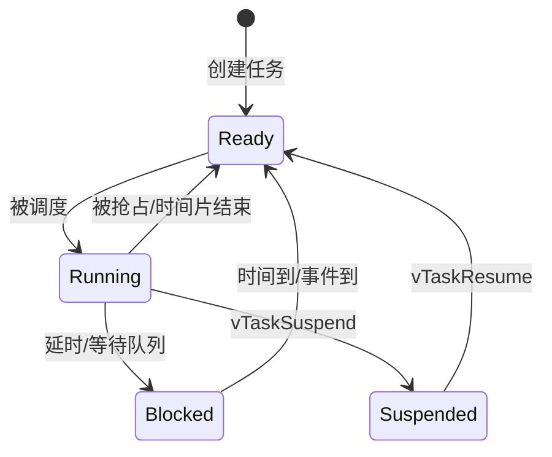

# FreeRTOS实时系统

## 1. 为什么引入RTOS

裸机程序常见结构：

```c
while(1)
{
    if(tick_1ms)
    {
        tick_1ms = 0;
        Control();
        Communication();
        Led();
    }
}
```

问题包括：任务边界不清楚、阻塞函数影响所有功能、周期难管理、扩展后调用链越来越长。

RTOS把不同工作组织为任务，并负责：

- 选择当前应运行的任务。
- 管理延时、超时和阻塞。
- 保存和恢复任务上下文。
- 提供任务间通信和同步机制。
> **说明：> RTOS不会自动让程序实时。错误的优先级、阻塞、共享数据或超长中断仍然会破坏实时性。**
## 2. 任务状态



| 状态 | 含义 |
|---|---|
| Running | 当前CPU正在执行 |
| Ready | 可以运行，但有更高优先级任务正在运行 |
| Blocked | 等待时间或事件，不参与CPU竞争 |
| Suspended | 被显式挂起，不会自动恢复 |

## 3. 创建任务

当前项目的任务创建位于 freertos_app.c。

```c
BaseType_t result = xTaskCreate(
    BalanceTask,       /* 任务入口 */
    "Balance",        /* 调试器显示名称 */
    768U,              /* 栈深度，单位为StackType_t，不是字节 */
    NULL,              /* 传给任务的参数 */
    5U,                /* FreeRTOS任务优先级 */
    NULL);             /* 可选任务句柄 */
```

参数说明：

| 参数 | 注意事项 |
|---|---|
| 任务入口 | 原型必须为 `void Task(void *argument)`，不能正常返回 |
| 名称 | 受 `configMAX_TASK_NAME_LEN` 限制 |
| 栈深度 | Cortex-M4下一个word为4字节，768 words约3072字节 |
| 参数 | 可传结构体指针，但必须保证生命周期 |
| 优先级 | 数值越大优先级越高，必须小于 `configMAX_PRIORITIES` |
| 句柄 | 用于通知、删除、挂起和查询任务 |

## 4. 周期任务

### 相对延时

```c
for(;;)
{
    DoWork();
    vTaskDelay(pdMS_TO_TICKS(10U));
}
```

真实周期等于 `DoWork()`执行时间加10 ms，因此会漂移。

### 绝对周期

```c
TickType_t last = xTaskGetTickCount();

for(;;)
{
    DoWork();
    (void)xTaskDelayUntil(&last, pdMS_TO_TICKS(10U));
}
```

每次唤醒目标基于上一次计划时间，适合控制和采样任务。

```text
计划唤醒：0, 10, 20, 30 ms
执行耗时：2 ms
xTaskDelayUntil等待到下一个绝对时间
```

如果执行超过周期，函数无法阻塞，意味着任务超期。项目用 `RTOS_ControlOverrunCount` 记录这种情况。

## 5. 调度器

```c
int main(void)
{
    HardwareInit();
    xTaskCreate(...);
    vTaskStartScheduler();

    for(;;) /* 正常情况下不会到达 */
    {
    }
}
```

启动后：

1. FreeRTOS创建Idle任务。
2. 配置SysTick。
3. SVC异常启动最高优先级就绪任务。
4. SysTick更新系统时间。
5. PendSV在需要时切换任务。

## 6. 当前配置参数

参考 FreeRTOSConfig.h。

| 参数 | 当前值 | 含义 |
|---|---:|---|
| `configCPU_CLOCK_HZ` | 200 MHz | 内核时钟，用于SysTick |
| `configTICK_RATE_HZ` | 1000 | 1 tick等于1 ms |
| `configMAX_PRIORITIES` | 7 | 任务优先级范围0到6 |
| `configMINIMAL_STACK_SIZE` | 128 words | Idle任务最小栈 |
| `configTOTAL_HEAP_SIZE` | 12 KB | `heap_4`管理的内存 |
| `configUSE_PREEMPTION` | 1 | 开启抢占调度 |
| `configCHECK_FOR_STACK_OVERFLOW` | 2 | 开启较完整的栈边界检查 |
| `configUSE_TIMERS` | 0 | 当前未启用软件定时器任务 |
| `configUSE_TICKLESS_IDLE` | 0 | 当前不做无节拍低功耗 |

## 7. 任务栈

任务栈保存：

- 局部变量。
- 函数返回地址。
- 被调用函数现场。
- 任务切换保存的寄存器。
- 使用FPU任务的浮点上下文。

危险例程：

```c
void BadTask(void *argument)
{
    uint8_t large_buffer[4096]; /* 一次占用4KB任务栈 */
    (void)argument;
    Use(large_buffer);
}
```

较大的缓冲区应放到静态区、专用内存池或由单一模块管理。

```c
UBaseType_t free_words = uxTaskGetStackHighWaterMark(NULL);
```

返回的是任务历史上最少剩余的word数，而不是当前瞬时剩余值。项目每秒把结果保存到 `RTOS_ControlStackMinWords`。

## 8. `heap_4`

`heap_4`使用一块静态数组实现动态内存，支持释放和相邻空闲块合并。

典型分配：

```text
xTaskCreate
  ├─ 分配TCB
  └─ 分配任务栈
```

常见问题：

- 总堆太小导致任务创建失败。
- 频繁创建/删除不同大小对象产生碎片。
- 忘记检查API返回值。
- 把C库 `malloc()` 和 `pvPortMalloc()` 混合使用。

```c
if(xTaskCreate(...) != pdPASS)
{
    FreeRTOS_FatalError();
}
```

## 9. 任务通信机制

| 机制 | 适合场景 | 是否传数据 |
|---|---|---|
| Queue | 多条有序消息、生产者消费者 | 是，复制数据 |
| Binary Semaphore | 表示事件发生 | 通常否 |
| Counting Semaphore | 资源计数或累计事件 | 计数 |
| Mutex | 保护任务间共享资源 | 否，带优先级继承 |
| Task Notification | 一对一高效事件/32位数据 | 是 |
| Event Group | 多个状态位组合等待 | 位集合 |

### 队列例程

```c
typedef struct
{
    float speed;
    float turn;
} Command_t;

QueueHandle_t command_queue;

command_queue = xQueueCreate(4U, sizeof(Command_t));

Command_t command = { 100.0f, 20.0f };
xQueueSend(command_queue, &command, pdMS_TO_TICKS(5U));
xQueueReceive(command_queue, &command, portMAX_DELAY);
```

### 任务通知例程

```c
TaskHandle_t rx_task_handle;

void USART1_IRQHandler(void)
{
    BaseType_t wake = pdFALSE;
    vTaskNotifyGiveFromISR(rx_task_handle, &wake);
    portYIELD_FROM_ISR(wake);
}

void RxTask(void *argument)
{
    for(;;)
    {
        ulTaskNotifyTake(pdTRUE, portMAX_DELAY);
        ProcessRxData();
    }
}
```
> **安全警告：> 使用FromISR API前，必须把USART中断优先级设置为数值5到15。当前优先级3不能直接使用这个例程。**
## 10. 优先级设计

当前第一阶段只有一个业务任务：

```text
ADC/FOC中断：NVIC 0，不调用RTOS
BalanceTask：FreeRTOS优先级5，周期1ms
IdleTask：FreeRTOS优先级0
```

后续拆分可考虑：

| 任务 | 建议优先级 | 周期/触发 |
|---|---:|---|
| ControlTask | 5 | 1 ms绝对周期 |
| RcTask | 4 | 串口事件或1 ms |
| ServiceTask | 2 | 5到10 ms |
| CalibrationTask | 1 | 按需，电机停机后运行 |

不要仅凭“功能重要”决定优先级，应根据周期和截止时间决定。

## 11. 故障钩子

```c
void vApplicationMallocFailedHook(void)
{
    FreeRTOS_FatalError();
}

void vApplicationStackOverflowHook(TaskHandle_t task, char *name)
{
    (void)task;
    (void)name;
    FreeRTOS_FatalError();
}
```

本项目的FatalError会关闭电机驱动和电源使能，再停机。生产版本还应保存故障码、点亮故障灯或触发看门狗复位。

## 本章练习

1. 写一个20 ms周期LED任务，分别用 `vTaskDelay` 和 `xTaskDelayUntil`，比较长期漂移。
2. 把任务栈从768 words减小，观察栈高水位和溢出钩子。
3. 设计USART空闲中断通知接收任务的方案，并重新规划中断优先级。
4. 计算12 KB堆中创建3072字节控制任务后大约还剩多少空间。

## 掌握检查

- [ ] 能解释任务四种主要状态。
- [ ] 能正确选择相对延时或绝对周期延时。
- [ ] 知道任务栈参数单位不是字节。
- [ ] 能区分队列、通知、信号量和互斥量。
- [ ] 能解释FromISR API的优先级限制。

上一章：[03-AT32外设驱动基础]({{ '/notes/at32-peripherals/' | relative_url }})  下一章：[05-实时并发与数据安全]({{ '/notes/realtime-concurrency/' | relative_url }})
