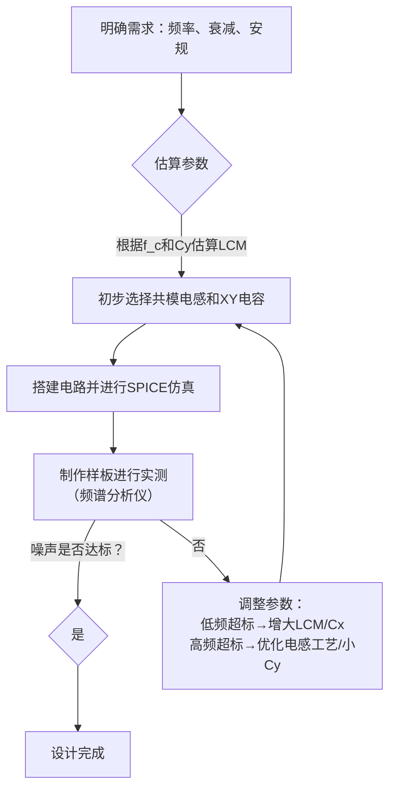

# LC滤波器

附件未随公开版发布：LC滤波器设计与制作.pdf

好的，这是一个非常实用的工程问题。共模电感（Common Mode Choke）与电容组成的滤波电路（通常称为**共模滤波器**）的计算和设计是一个系统性的过程，它更依赖于对标准件的选择和基于实测的调整，而非纯粹的理论计算。

下面我将为您详细解释其工作原理、设计步骤、计算方法以及注意事项。

---

### 一、电路结构与工作原理

一个典型的共模滤波电路如下图所示，通常位于电源输入端口：

*   **共模电感 (L1, L2)**：绕在同一磁芯上的两个电感，匝数相同、方向相同。其对**共模干扰**（线-地之间的噪声）呈现出高阻抗，而对**差模干扰**（线-线之间的噪声）的阻抗几乎为零（因为电流产生的磁场相互抵消）。
*   **X电容 (Cx1, Cx2)**：连接在火线（L）和零线（N）之间，主要用于衰减**差模干扰**。其容量通常较大（nF到μF级）。
*   **Y电容 (Cy1, Cy2)**：分别连接在火线-地（PE）和零线-地（PE）之间，主要用于衰减**共模干扰**。其容量必须很小（通常≤4.7nF），以确保在电网故障时流过人体的漏电流在安全范围内（安规要求）。

**工作原理简述**：噪声信号试图从电源线传入设备。共模电感对共模噪声形成阻碍，Y电容为共模噪声提供了一条对地的低阻抗泄放路径。X电容则为差模噪声提供了一条低阻抗的短路路径。

---

### 二、设计步骤与计算方法

严格的理论计算非常复杂，需要建立共模和差模的等效电路模型。在实际工程中，通常采用以下步骤：

#### 第1步：明确滤波器的性能指标

*   **需要衰减的噪声频率范围 (f)**：例如，主要想抑制30MHz以上的噪声。这是最重要的目标。
*   **需要的插入损耗 (Insertion Loss)**：期望在目标频率上衰减多少dB（如40dB）。
*   **额定电压和电流**：电路工作的电压和最大电流。
*   **安规标准**：如UL, CE, IEC等，这决定了元件（尤其是X、Y电容）的选型。

#### 第2步：共模电感的估算与选择

共模电感是滤波器的核心。其阻抗决定了滤波器的截止频率。

1.  **确定截止频率 (f_c)**：
    滤波器的截止频率是其阻抗开始显著增加的起点。你可以设定一个希望滤波器开始起作用的频率点。共模滤波器的传输特性可以近似看作一个二阶低通滤波器，其截止频率公式为：
    $$f_c = \frac{1}{2\pi\sqrt{L_{CM} \cdot C_Y}}$$
    *   `L_CM` 是**单一边的共模电感值**（例如，如果电感规格书上写“10mH”，通常就是指单一边的电感值）。
    *   `C_Y` 是**Y电容的容值**（通常是两个Y电容的并联值，即`Cy1 + Cy2`）。

2.  **估算所需电感值**：
    根据上述公式变形，在已知目标截止频率 `f_c` 和初步选定的 `C_Y` 后，可以估算所需的共模电感值：
    $$L_{CM} \approx \frac{1}{(2\pi f_c)^2 \cdot C_Y}$$
    **举例**：假设目标截止频率 `f_c` 为 150kHz，选定Y电容总和为 4.7nF。
    $$L_{CM} \approx \frac{1}{(2\pi \times 150 \times 10^3)^2 \times 4.7 \times 10^{-9}} \approx 240 \mu H$$
    这意味着你需要选择一个单边电感量约为240μH的共模电感。

3.  **选择电感的其他关键参数**：
    *   **电流容量**：额定电流必须大于电路的最大工作电流，否则会导致磁饱和，电感量急剧下降，滤波器失效。
    *   **直流电阻 (DCR)**：DCR越小越好，否则会产生额外的功率损耗和压降。
    *   **频率特性**：确保电感在目标噪声频率下仍能保持较高的Q值和有效电感量。

#### 第3步：X电容和Y电容的选择

1.  **Y电容 (Cy)**：
    *   **容值**：通常非常小，一般为**1nF, 2.2nF, 4.7nF**。安规标准（如IEC 60335）严格限制了地线漏电流，因此Y电容不能太大。
    *   **类型**：**必须使用安规认证的Y电容**（通常是Y1或Y2级），其失效模式是开路，而不是短路，以保证安全。

2.  **X电容 (Cx)**：
    *   **容值**：比Y电容大，常见的有100nF, 470nF, 1μF等。它主要负责低频差模干扰。
    *   **类型**：**必须使用安规认证的X电容**（通常是X1或X2级）。

#### 第4步：迭代、仿真与实测调整

1.  **理论计算的局限性**：
    *   上述计算是高度简化的，没有考虑寄生参数（如电感的分布电容、电容的ESL）。
    *   实际电路中，共模电感的分布电容会在很高频率（>10MHz）时与电感发生并联谐振，导致其阻抗下降，滤波效果变差。这就是为什么共模电感有有效频率范围。

2.  **使用仿真软件**：
    *   使用SPICE等工具，导入厂商提供的共模电感和电容的详细模型（包含寄生参数），进行频域分析（AC Sweep），查看其插入损耗曲线是否符合要求。

3.  **最终依靠实测验证**：
    *   **这是最关键的一步**。使用**频谱分析仪**和**网络分析仪**在实际电路上进行传导噪声测试（依据CISPR 25等标准）。
    *   观察噪声频谱，如果某个频点超标，相应地调整元件参数：
        *   **低频段超标**：通常需要**增大共模电感值**或**增大X电容值**。
        *   **高频段超标**：可能是共模电感在高频下失效了。需要换用**分布电容更小**的特殊绕法（如分段绕制）的共模电感，或者**并联一个小容量的Y电容**（如100pF）。

---

### 三、总结与设计流程框图

综上所述，一个实用的设计流程如下：

**核心要点记住**：
1.  **共模电感对付共模噪声**，其感量 `L_CM` 和Y电容 `C_Y` 共同决定**共模截止频率**。
2.  **X电容对付差模噪声**。
3.  **安规优先**：尤其是Y电容，必须用安规认证的。
4.  **理论计算只是起点**，最终必须通过**实测**来验证和调整。
5.  高频性能受寄生参数影响极大，选择合适的元件比精确计算更重要。
