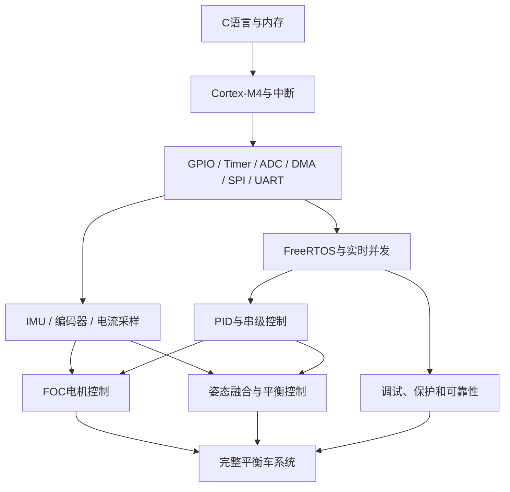
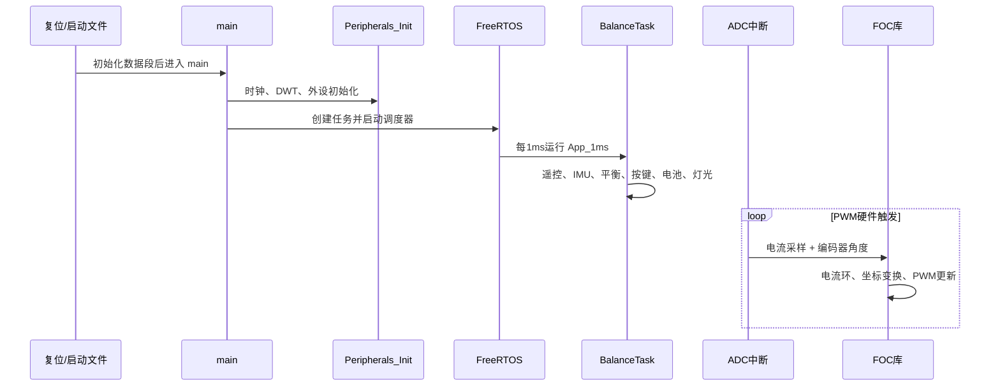

# 教程总览

## 你最终要建立的知识模型

## 推荐学习顺序

| 阶段 | 内容 | 达标标准 |
|---|---|---|
| 1 | [01-C语言与嵌入式内存]({{ '/notes/c-language-memory/' | relative_url }}) | 能解释 `volatile/static/extern` 和栈、堆、BSS |
| 2 | [02-Cortex-M4与中断系统]({{ '/notes/cortex-m4-interrupts/' | relative_url }}) | 能画出复位到 `main()`、中断进入与退出流程 |
| 3 | [03-AT32外设驱动基础]({{ '/notes/at32-peripherals/' | relative_url }}) | 能独立配置 GPIO、定时器、ADC、DMA、SPI、UART |
| 4 | [04-FreeRTOS实时系统]({{ '/notes/freertos-realtime/' | relative_url }}) | 能创建周期任务并解释 SysTick/PendSV/SVC |
| 5 | [05-实时并发与数据安全]({{ '/notes/realtime-concurrency/' | relative_url }}) | 能判断共享变量是否存在竞态条件 |
| 6 | [06-PID与数字控制]({{ '/notes/pid-digital-control/' | relative_url }}) | 能写离散 PI/PID 并实现限幅、抗积分饱和 |
| 7 | [07-FOC无刷电机控制]({{ '/notes/foc-motor-control/' | relative_url }}) | 能解释 Clarke/Park、Id/Iq、SVPWM 和电角度 |
| 8 | [08-平衡车姿态与串级控制]({{ '/notes/balance-car-cascade-control/' | relative_url }}) | 能解释直立环、速度环、转向环如何组合 |
| 9 | [09-传感器与数字滤波]({{ '/notes/sensors-digital-filtering/' | relative_url }}) | 能完成单位换算、零偏校准和一阶滤波 |
| 10 | [10-串口-DMA与BLE协议]({{ '/notes/uart-dma-ble/' | relative_url }}) | 能设计带帧头、长度和校验的数据协议 |
| 11 | [11-调试故障与上板流程]({{ '/notes/debug-and-hardware-bringup/' | relative_url }}) | 能从 HardFault、MAP、波形和日志定位故障 |
| 12 | [12-项目源码导读与练习]({{ '/notes/project-code-reading/' | relative_url }}) | 能沿调用链独立修改一个功能并验证 |

## 当前工程运行主线

对应源码：

- `main.c`
- `app.c`
- `freertos_app.c`
- `adc.c`
- `Control.c`

## 三条必须始终记住的边界
> **安全警告：硬实时边界**
> ADC/FOC中断不能改成普通任务。调度器带来的延迟和抖动会破坏电流采样与PWM更新时序。
> **注意：中断API边界**
> NVIC优先级数值0到4的中断不能调用FreeRTOS API。允许调用 `...FromISR()` 的中断优先级必须为5到15。
> **注意：功率安全边界**
> 软件“跑起来”不等于电机可以直接落地测试。任何符号、方向、采样比例或PID错误都可能导致电机瞬间全输出。

## 学习方法

每个知识点按下面四步巩固：

1. 不看源码，用自己的话解释概念。
2. 手写一个最小例程。
3. 在当前工程找到对应实现。
4. 修改一个参数，预测现象，再通过调试器或示波器验证。

## 总体自测

- [ ] 能解释为什么PWM和FOC必须在硬件触发链路中运行。
- [ ] 能解释为什么FreeRTOS使用SysTick，而微秒延时改用DWT。
- [ ] 能解释任务优先级和NVIC中断优先级不是同一个体系。
- [ ] 能从遥控输入一直追踪到左右电机PWM输出。
- [ ] 能计算IMU、编码器、ADC原始值对应的物理量。
- [ ] 能根据MAP文件判断RAM是否足够创建任务。
- [ ] 能设计安全的上电、校准、运行、故障、停机状态机。
