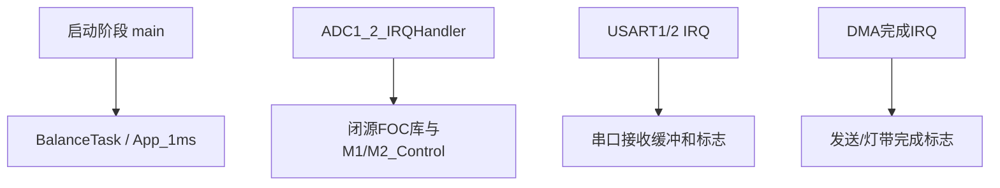

# 实时并发与数据安全

## 1. 本项目有哪些执行上下文



这些上下文不是按源码顺序执行。任务执行到任意指令时，都可能被更高优先级中断打断。

## 2. 什么是竞态条件

```c
uint32_t count;

/* 任务 */
count++;

/* 中断 */
count++;
```

`count++`通常被编译为：

```text
读取count → 加1 → 写回count
```

可能发生：

```text
任务读取10
中断读取10、写入11
任务恢复、写入11
```

预期结果12，实际结果11，这就是丢失更新。

## 3. 原子性不等于一致性

Cortex-M4对对齐的32位读写通常是单条指令，因此一个 `float` 写入通常不会出现“半个旧值、半个新值”。

但是两个字段不构成一个原子整体：

```c
ControlOut_L = new_left;
/* ADC中断可能在这里发生 */
ControlOut_R = new_right;
```

ADC中断可能看到“新左轮目标 + 旧右轮目标”。这称为一致性问题。

## 4. `volatile`不能解决竞态

```c
volatile float target_speed;
```

`volatile`只能要求编译器真实读写，不会：

- 禁止中断抢占。
- 保证复合运算原子。
- 保证多个变量同时更新。
- 建立任务之间的互斥。
- 自动刷新DMA缓存或解决内存顺序。

## 5. 单一所有者原则

最简单可靠的并发设计是让一个执行上下文拥有一类数据。

```text
RcTask拥有串口协议解析状态
ControlTask拥有整车目标和保护状态
ADC/FOC中断拥有瞬时电流采样和PWM更新
ServiceTask拥有灯光状态
```

其他模块通过队列、任务通知或只读快照交换数据，而不是到处直接修改全局变量。

## 6. 短全局临界区

当任务需要同时发布左右目标，且优先级0 ADC必须读取它们时，可以使用极短的PRIMASK临界区：

```c
void PublishMotorTargets(float left, float right)
{
    uint32_t primask = __get_PRIMASK();
    __disable_irq();

    ControlOut_L = left;
    ControlOut_R = right;

    __set_PRIMASK(primask);
}
```

临界区只包含两个赋值，通常是可接受的。下面这种写法不可接受：

```c
__disable_irq();
CalculatePID();
printf("debug");
WriteFlash();
__enable_irq();
```

它会直接阻塞FOC电流采样和PWM更新。

## 7. FreeRTOS临界区的边界

```c
taskENTER_CRITICAL();
shared_state = new_state;
taskEXIT_CRITICAL();
```

FreeRTOS临界区通过BASEPRI屏蔽数值5及更低紧迫度的中断，优先级0 ADC仍然可以抢占。因此：

- 适合保护任务之间或RTOS管理范围内的中断共享数据。
- 不足以保护被FOC高优先级中断访问的数据。

## 8. 序列锁快照

不希望关闭中断时，可使用序列号检测读取期间是否发生更新。

```c
typedef struct
{
    float left;
    float right;
} MotorTarget_t;

static volatile uint32_t target_sequence;
static volatile MotorTarget_t target;

void Target_Write(float left, float right)
{
    target_sequence++;
    target.left = left;
    target.right = right;
    target_sequence++;
}

MotorTarget_t Target_Read(void)
{
    MotorTarget_t copy;
    uint32_t before;
    uint32_t after;

    do
    {
        before = target_sequence;
        copy.left = target.left;
        copy.right = target.right;
        after = target_sequence;
    }
    while((before != after) || ((before & 1U) != 0U));

    return copy;
}
```

写入开始时序列号变奇数，完成后变偶数。读取者只有在前后序列号相同且为偶数时才接受快照。
> **说明：> 这是简化示例。严格实现还要考虑编译器和CPU内存屏障；Cortex-M单核环境较简单，但不能把示例盲目移植到多核系统。**
## 9. 双缓冲

适合较大的配置或采样数据：

```text
任务写后备缓冲区
任务完成后原子切换活动索引
中断始终读取当前活动缓冲区
```

```c
static MotorTarget_t buffers[2];
static volatile uint32_t active_index;

void Target_Publish(const MotorTarget_t *new_target)
{
    uint32_t next = active_index ^ 1U;
    buffers[next] = *new_target;
    active_index = next;
}
```

活动索引必须是原子可读写的对齐32位值。

## 10. 优先级反转

```text
高优先级ControlTask等待互斥量
低优先级DebugTask持有互斥量
中优先级任务不断抢占DebugTask
ControlTask长时间无法运行
```

FreeRTOS Mutex提供优先级继承：低优先级持有者临时提升到等待者优先级，以便尽快释放资源。

二值信号量不提供同样的所有权语义，不应替代Mutex保护任务共享资源。

## 11. 阻塞函数

高优先级控制任务中应避免：

- 无限等待SPI或I2C标志。
- Flash整扇区擦写。
- 阻塞式串口打印。
- 长时间动态内存分配。
- 未设置超时的设备初始化循环。

当前 `IMU_Init()` 会持续等待正确的WHO_AM_I，应改成带次数限制的初始化状态机。

```c
bool IMU_InitWithTimeout(uint32_t retries)
{
    while(retries-- > 0U)
    {
        if(IMU_Read_Reg(MPU6500_WHO_AM_I) == 0x70U)
        {
            return true;
        }
        delay_ms(1U);
    }
    return false;
}
```

## 12. 周期、执行时间和截止时间

| 概念 | 含义 |
|---|---|
| Period | 任务多久释放一次，例如1 ms |
| Execution time | 一次实际用了多少CPU时间 |
| WCET | 最坏情况下的最大执行时间 |
| Deadline | 必须完成的最晚时间 |
| Jitter | 实际开始时间相对计划时间的波动 |

如果控制任务周期1 ms、截止时间1 ms，最坏执行时间必须显著小于1 ms，还要给ADC等中断预留CPU时间。

## 13. DWT测量例程

```c
uint32_t start = DWT->CYCCNT;
App_1ms();
uint32_t cycles = DWT->CYCCNT - start;

float elapsed_us = cycles / 200.0f;
```

建议记录：平均执行时间、最大执行时间、触发校准命令时的最大时间、开启调试输出时的最大时间。

## 14. CPU利用率粗略估算

```text
利用率 = 执行时间 / 周期
```

例如：

```text
1ms任务平均执行200us → 20%
FOC中断每100us执行20us → 20%
其他中断和Idle → 剩余60%
```

真实系统需要把中断嵌套、最坏情况和缓存/Flash等待考虑进去。

## 本章练习

1. 列出 `ControlOut_L/R`、`M1_Foc/M2_Foc`、USART标志分别由谁读写。
2. 给左右电机目标增加一个一致性发布函数。
3. 使用DWT测量普通运行、串口打印和Flash保存时的 `App_1ms()` 时间。
4. 解释为什么在1 ms控制任务中直接擦除Flash会造成超期。

## 掌握检查

- [ ] 能区分可见性、原子性和一致性。
- [ ] 知道何时使用PRIMASK、FreeRTOS临界区或互斥量。
- [ ] 能识别优先级反转。
- [ ] 能测量并解释任务WCET和抖动。
- [ ] 能为共享数据指定唯一所有者。

上一章：[04-FreeRTOS实时系统]({{ '/notes/freertos-realtime/' | relative_url }})  下一章：[06-PID与数字控制]({{ '/notes/pid-digital-control/' | relative_url }})
