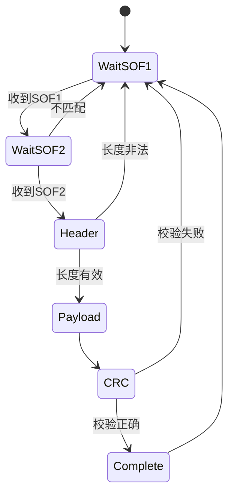

# 串口、DMA与BLE协议

## 1. 通信链路


ESP32端参考 ESP32C3_Receiver.ino，AT32端参考 usart.c 和 RcData.c。

## 2. UART帧格式

项目使用8数据位、无校验、1停止位，即8N1。

```text
空闲高电平
→ Start(0)
→ D0...D7
→ Stop(1)
```

每个8位字节占10个串行位。理论字节率：

```text
byte_rate = baud_rate / 10
```

| 波特率 | 理论最大字节率 |
|---:|---:|
| 115200 | 11520 byte/s |
| 230400 | 23040 byte/s |
| 921600 | 92160 byte/s |

实际吞吐还受帧间隔、DMA处理和软件复制影响。

## 3. DMA变长接收

DMA被配置接收最多128字节，空闲中断到来时读取剩余计数：

```c
uint16_t length = BUFFER_SIZE -
    dma_data_number_get(DMA1_CHANNEL5);
```

典型处理：

```c
void USART1_IRQHandler(void)
{
    if(usart_flag_get(USART1, USART_IDLEF_FLAG) != RESET)
    {
        volatile uint32_t clear = USART1->sts;
        clear = USART1->dt;
        (void)clear;

        uint16_t length = BUFFER_SIZE -
            dma_data_number_get(DMA1_CHANNEL5);

        dma_channel_enable(DMA1_CHANNEL5, FALSE);
        memcpy(process_buffer, dma_buffer, length);
        dma_data_number_set(DMA1_CHANNEL5, BUFFER_SIZE);
        dma_channel_enable(DMA1_CHANNEL5, TRUE);
    }
}
```

参数与风险：

- 必须按芯片要求清除IDLE标志。
- 必须防止 `length` 超过目标缓冲区。
- DMA停用和重启之间到来的字节可能丢失。
- 中断内 `memcpy` 越长，中断占用越高。
- 任务读取处理缓冲区时，中断可能再次覆盖。

更可靠方案是双缓冲或环形DMA加读写索引。

## 4. 当前遥控包识别

项目检查：

```c
data[0] == 0x20
data[1] == 0x0F
data[14] == 0x02  /* 游戏手柄 */
```

小程序包使用 `data[14] == 0x66`。

这种协议至少需要先确认实际长度大于14，否则短包也会访问旧数据。

推荐：

```c
if((length >= 15U) &&
   (data[0] == 0x20U) &&
   (data[1] == 0x0FU))
{
    ParsePacket(data, length);
}
```

## 5. 摇杆数据处理

手柄摇杆原始中点为128：

```c
int16_t centered = (int16_t)raw - 128;
```

死区处理：

```c
float ApplyDeadband(int16_t value, int16_t deadband)
{
    if(value > deadband)
        return (float)(value - deadband);
    if(value < -deadband)
        return (float)(value + deadband);
    return 0.0f;
}
```

死区用于消除摇杆中点抖动。死区过大则小幅控制不灵敏。

平滑处理：

```c
filtered += alpha * (command - filtered);
```

前后和转向可使用不同alpha，以获得不同手感。

## 6. 通信超时

如果蓝牙断开，最后一条前进命令不能永久保留。

```c
if(++rx_timeout_ms >= 150U)
{
    target_speed = ApproachZero(target_speed);
    target_turn = ApproachZero(target_turn);
}
```

安全系统可进一步规定：

- 超时先将目标斜坡降到0。
- 超时持续更久进入保护状态。
- 恢复通信后要求摇杆回中才能重新使能。

## 7. 校准命令协议

USART2校准帧：

```text
0xA0 0xAA CMD CHECK 0x66
```

校验：

```c
check = data[0] + data[1] + data[2] + data[4];
```

命令示例：

| CMD | 功能 |
|---:|---|
| 1 | 校准陀螺零偏 |
| 2 | 校准左电机电角度 |
| 3 | 校准右电机电角度 |
| 4 | 关闭电机 |
| 5 | 保存参数 |
| 6 | 清除参数 |
| 7 | 开启调试输出 |

简单累加校验容易发生碰撞，更完整协议建议使用CRC16。

## 8. 推荐协议结构

```text
SOF1 SOF2 VERSION TYPE LENGTH SEQUENCE PAYLOAD CRC16
```

| 字段 | 作用 |
|---|---|
| SOF | 帧同步，例如 `0xAA 0x55` |
| VERSION | 协议版本，便于兼容升级 |
| TYPE | 消息类型 |
| LENGTH | Payload长度 |
| SEQUENCE | 检测丢包和重复包 |
| PAYLOAD | 业务数据 |
| CRC16 | 检测传输错误 |

解析状态机：



## 9. 序列化与字节序

项目发送电压低字节在前：

```c
uint16_t voltage = (uint16_t)(Car.BatVin_filter * 100.0f);
tx[0] = (uint8_t)(voltage & 0xFFU);
tx[1] = (uint8_t)(voltage >> 8);
```

接收端恢复：

```c
uint16_t voltage = (uint16_t)rx[0] |
                   ((uint16_t)rx[1] << 8);
```

这叫小端字节序。协议必须明确字节序，不能直接发送编译器结构体内存。

### 不推荐

```c
UART_Send((uint8_t *)&my_struct, sizeof(my_struct));
```

原因：结构体填充、浮点格式、字节序和版本变化会破坏兼容性。

### 推荐

```c
void WriteU16LE(uint8_t *out, uint16_t value)
{
    out[0] = (uint8_t)value;
    out[1] = (uint8_t)(value >> 8);
}
```

## 10. CRC16示例

```c
uint16_t CRC16_Modbus(const uint8_t *data, uint16_t length)
{
    uint16_t crc = 0xFFFFU;

    while(length-- > 0U)
    {
        crc ^= *data++;
        for(uint8_t bit = 0U; bit < 8U; bit++)
        {
            if((crc & 1U) != 0U)
                crc = (crc >> 1) ^ 0xA001U;
            else
                crc >>= 1;
        }
    }
    return crc;
}
```

发送端和接收端必须统一初值、多项式、输入输出反转和CRC字节序。

## 11. BLE接收端

ESP32-C3程序作为BLE客户端：

1. 扫描名称为 `BM769 24G` 的设备。
2. 首次发现后保存MAC到EEPROM。
3. 后续按MAC自动匹配。
4. 连接指定Service UUID。
5. 遍历Characteristic并订阅Notify。
6. Notify回调将原始数据写入UART1。

```c
void notifyCB(..., uint8_t *data, size_t length, ...)
{
    uart_write_bytes(UART_NUM_1, (char *)data, length);
}
```

当前ESP32代码没有读取AT32返回的电压数据，因此AT32每100 ms发送的4字节电压包暂未形成完整业务闭环。

## 12. RTOS化通信建议

第一阶段仍由1 ms任务轮询 `U1_IDLE_Flag`。后续可改为：

```text
USART IDLE中断
→ 切换DMA缓冲区
→ vTaskNotifyGiveFromISR
→ RcTask解析完整帧
→ 通过队列发布最新控制命令
→ ControlTask消费命令快照
```

这样协议解析和内存复制不会占用高优先级控制任务。

## 本章练习

1. 给现有遥控包增加长度检查和序列号检查。
2. 写一个字节流状态机，即使从帧中间开始也能重新同步。
3. 把校准协议改为含长度和CRC16的版本。
4. 设计ESP32接收AT32电压包并显示/转发的逻辑。
5. 计算921600波特率下发送72字节调试包需要的理论时间。

## 掌握检查

- [ ] 能计算UART理论吞吐率。
- [ ] 能解释DMA加空闲中断的变长帧接收。
- [ ] 能设计帧头、长度、序列号和CRC。
- [ ] 能正确处理多字节整数的字节序。
- [ ] 能规划中断、通信任务和控制任务之间的数据流。

上一章：[09-传感器与数字滤波]({{ '/notes/sensors-digital-filtering/' | relative_url }})  下一章：[11-调试故障与上板流程]({{ '/notes/debug-and-hardware-bringup/' | relative_url }})
